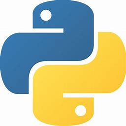

# Wiedereinstieg in Python nach einer längeren Pause

Mein Wiedereinstieg in Python war nicht einmal so schwierig. Ich wusste noch die meisten Sachen, musste aber trotzdem ein paar mal spicken.   

Ich habe mit turtle angefangen. Dort gibt es Befehle wie `forward()`, `left()`, `right()` usw. welche mir im Kopf geblieben sind. Andere Befehle wie `penup()` oder `pencolor()` wusste ich z.B. nicht mehr.  

Es ist mir nicht nur einmal passiert, dass ich `rigth()` anstelle von `right()` geschrieben habe. Dann habe ich lange nach dem Fehler gesucht und als ich ihn endlich gefunden habe, kam ein verwundertes "Ooooh".

Danach ging es darum schleifen zu machen, damit man einzelne Codeabschnitte nicht hundert mal wiederholen muss, aber ich habe schon Schleifen gemacht, bevor es überhaupt eingeführt wurde.  

Zu guter letzt, war es die Aufgabe, Fehler in einem Code zu finde. das fiel mir aber auch leicht.  