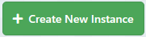
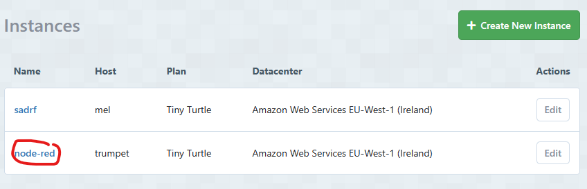
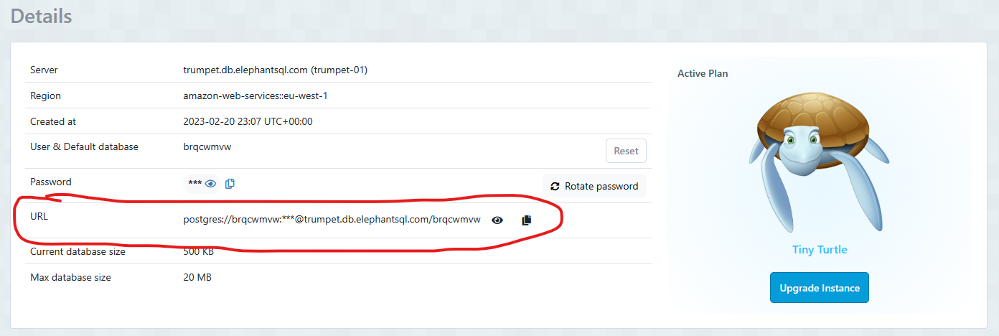
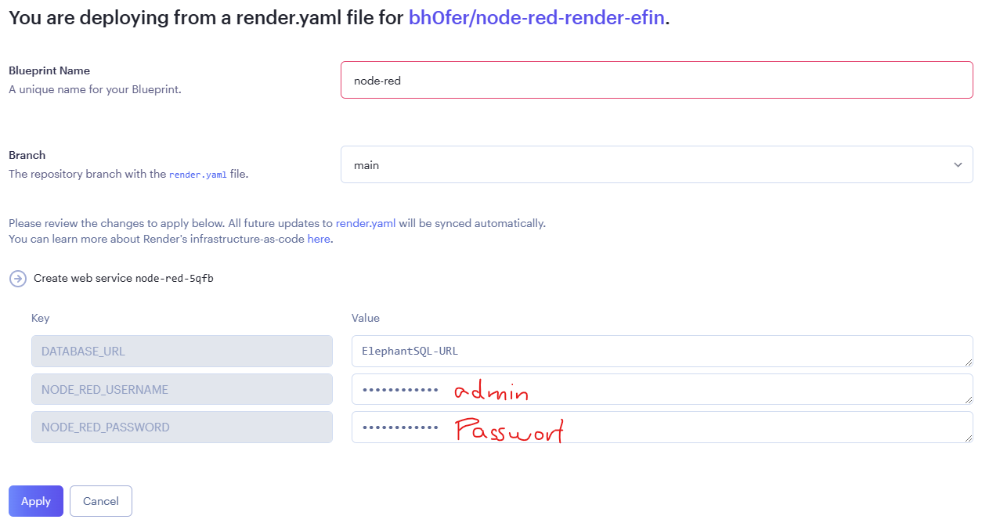
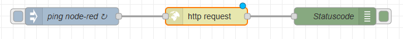
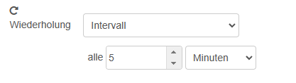
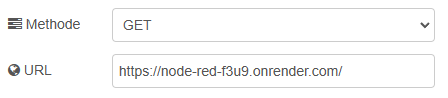
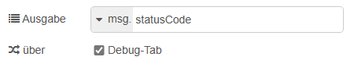

# API erstellen

In Diesem Blogeintrag lernt ihr, was eine API ist und auch, wie ihr eine eigene API aufsetzen könnt.  

## Erstellen der Datenbank
Wir fangen auf der Webseite ElephantSQL.com an. Dort Erstellen über den Knopf `+ create New Instance` eine neue Datenbank.  
   
Als Namen habe ich jetzt `node-red` genommen und als plan habe ich `Tiny Turtle (Free)` genommen, da das, wie der Name schon sagt, gratis ist. Wenn man will, kann man aber einen eigenen plan nehmen, falls man mit grösseren Datenmengen arbeiten will.  
Jetzt müssen wir nur noch die Erstellung abschliessen und sobald wir wieder bei der Übersicht über unsere Instanzen sind, klicken wir auf den Namen unserer Instanz  
  
und kopieren die URL, die in der Tabelle bei URL: angegeben ist. Sie sollte folgendes Format haben: `postgres://...@....db.elephantsql.com...`  
  

## Node-RED auf Render installieren 
Jetzt installieren wir über den folgenden Link Node-RED auf Render.com: `https://dashboard.render.com/login?next=/blueprint/new?repo=https://github.com/bh0fer/node-red-render-efin`  
Als Namen geben wir `node-red` ein, als DATABASE_URL geben wir die vorher kopierte ElephantSQL-URL ein, als Namen nehmen wir `admin` und als Passwort setzen wir selbst eines, dass sehr sicher ist. Anschliessend müssen wir nur noch auf `apply` klicken.  
  

## Was soll die API machen?
Wir können nun über das Dashboard auf Render.com den Link zu unserer API aufrufen. Beim ersten Mal kann das ein bisschen länger dauern, da der Server nicht konstant online ist, da es sich um einen gratis-plan handelt. Jetzt müssen wir uns anmelden und können schon sagen, was die API machen soll.  
### Keep-Alive
Beim ersten Aufstarten der API haben wir gemerkt, dass das schon ein bisschen lange gedauert hat. Das liegt daran, dass der Server auf dem unsere API ist, automatisch heruntergefahren wird, um ressourcen zu sparen. Um dem zu entgehen, erstellen wir einen Flow, der den Link des Servers immer wieder aufruft, damit er online bleibt.  
  
Fangen wir beim ersten Block an. Der `ping node-red`-Block ist ein Block. Bei diesem sollten noch folgende Sachen verändert werden, damit die Seite alle 5 Minuten aufgerufen wird:  
  
Der `http request`-Block ist ein !ACHTUNG! Block. Dieser sollte noch folgendermassen bearbeitet werden:  
  
Als URL sollte jedoch die eigene URL eingesetzt werden.  
Zuletzt haben wir noch den `Statuscode`-Block. Dabei handelt es sich um einen Block. Dieser gibt den Statuscode `200` in der Debug-Konsole aus, wenn der Keep alive Flow erfolgreich ausgeführt wurde. Dafür müssen die Einstellungen aber wie folgt aussehen:  
  
Somit haben wir eine API erstellt, aber was können wir sonst noch tun?
