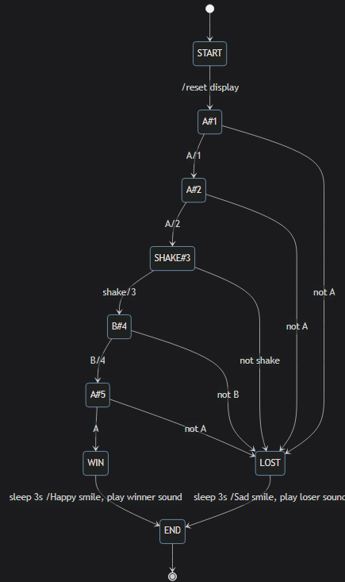

# Schriftliche Matur

# Programmieren / Software-Engineering

* Top-Down / Bottom Up Entwürfe, Divide & Conquer  
    * Divide & Conquer:  
    Teile und Herrsche heisst, ein Problem, welches schwer zu lösen ist in kleinere Probleme aufteilen um diese vielleicht einfacher zu lösen. Dafür wird in der Informatik meistens eine Kombination zwischen Top-Down und Bottom-Up verwendet.  
    
    * Top-Down:  
    Ein grosses Problem wird so häufig in kleinere Teilprobleme geteilt, bis man zu den einzelnen Problemen Funktionen schreiben kann um diese zu lösen. Anschliessend werden die einzelnen Funktionen zusammengeführt, sodass das grosse Problem gelöst ist.  
    * Bottom-up:  
    Hier beginnt man zuerst unten. Das heisst man versucht von Anfnag an die kleinen Probleme zu lösen um sie dann zusammenzufügen, damit ein grösseres Problem gelöst ist. Hier kann es aber passieren, dass man eine ungüsntige Aufteilung in Teilprobleme erhält.  
    

* Programm-Code (Python) lesen & verstehen
  * nochmals NumTrip durchgehen
  * Alte Prüfungen, insb. praktischen 
* Wie funktioniert Python?
  * Scopes? `global`, Unterschied von "Pass by Value" und "Pass by Reference"?

```python
name = 'Marc'
def say_hi(name): # Argument: die übergebene """"Variable""""
  print(f'Hello {name}')
  
say_hi('Reto')

def greet_class(names):
  print(f'Hello everybody! {names}')
  names[0] = 'Maria'
  names = ['Bello']
 
ef = ['Timon', 'Lia']
greet_class(ef)
print(ef)
```

* Fehlerbehandlung / Benutzereingabe
  * `a = int(input('Dein Alter?')`)
* Arbeiten in Teams:
  * Versionsverwaltung Git
* Datenstrukturen
  * 1D, 2D, 3D, nD Listen


***

# Datenbanken / Webapps / API

* ER Diagramme, Kardinalitäten, Zwischentabellen, Primary Key, Foreign Key  
    * ER Diagramme:  
      Entity-Relationship-Diagramme beschreiben Entitäten, Attribute, Beziehungen und Kardinalitäten. Zuerst werden die Entitäten bestimmt.

      
    * Entität:  
    Ein Objekt au der Realsituation, über das Informationen zu speichern sind. Entitäten sind z.B. Verlag oder Buch. Entitäten werden auf ER-Diagrammen als Rechteck dargestellt.
    * Attribut:  
    Attribute beschreiben Eigenschaften von Entitäten oder Beziehungen. Bei einem Buch könnte das z.B. der Titel, der Preis etc. sein. Attribute werden auf ER-Diagrammen als Elypsen dargestellt. 
    * Beziehung:  
    Sie beschreiben den Zusammenhang zwischen Entitäten. Die Entität "Verlag" hat zur Entität "Buch" die Beziehung "veröffentlicht". Beziehungen werden im ER-Diagramm als Rauten dargestellt. 
    * Kardinalitäten:  
      BEschreibt wie viele Entitäten einer Entitätsmenge an einer konkreten Beziehung beteiligt werden müssen / können. Es gibt die Kardinalitäten 1 (kein oder ein) und m bzw. n (kein, ein, mehrere). Damit sind folgende Beziehungsarten möglich:
        * 1:1  
        Bsp.: Jedes Buch hat genau eine Darstellung, eine Darstellung bezieht sich immer auf das gleiche Buch
        * 1:n  
        Bsp.: Ein Buch wurde von einem Verlag veröffentlicht, ein Verlag kann beliebig viele Bücher veröffentlichen
        * m:n  
        Bsp.: Ein Buch kann von beliebig vielen Menschen bestellt werden, ein Mensch kann beliebig viele Bücher bestellen
    * Zwischentabellen:  
      
    * Primary Key:  
      Jede Entitätsmenge erhält einen Primärschlüssel. Er ist nie gleich. Bei den Büchern kann das die ISBN sein, die pro Buch nur einmal vergeben wird. Der Primärschlüssel wird doppelt unterschrichen. 
    * Foreign Key:  

* Normalisierung, 3 NF
    * Normalisierung:  
      Dabei wird eine Datenbank, dessen Daten weniger gut strukturiert sind, so neu strukturiert, dass Redundanzen ausgeschlossen werden können, aber keine Daten verloren gehen.  

    * NF 1:  
      Alle Attribute weisen einen atomaren Wertebereich auf. Das heisst, sie sind so kleine wie möglich gemacht.  

    * NF 2:  
      Die Tabelle muss in NF 1 sein und jedes Nichtschlüsselattribut muss voll funktional abhängig vom Primärschlüssel sein.  
  
 
    * NF 3:  
    Die Tabelle muss in der NF 2 sein und es darf keine funktionalen Abhängigkeiten zwischen Nichtschlüsselattributen geben.  

 
       
* HTTP-Requests, Web-API (GET, POST, UPDATE, DELETE)
    * HTTP-Request:  
      Sind Anfragen von einem Client an einen HTTP-Server.
    * Web-API:  
      API's sind Versionen der Webseite, die ein Server lesen kann. Dabei werden unnötige Daten wie Bilder ignoriert und andere Daten wie Jahrgang eines Filmes werden so dargestellt, dass sie einfach abrufbar sind (name = 'Titanic')
        * GET: wird verwendet um eine Ressource anzufordern
        * POST: wird verwendet um eine Ressource zu erschaffen 
        * PUT: wird verwendet um eine Ressource zu ersetzen oder zu erneuern
        * DELETE: wird verwendet um eine Ressource zu löschen
* Cookie, Anmeldedaten, speichern auf Server/DB —> Hash
    * Cookie:  
      Sind kleine Textdateien die lokal gespeichert werden. Kehrt man auf eine Seite zurück, kann diese das Gerät anhand der Cookies erkennen. 
    * Anmeldedaten:  
      Anmeldedaten sind z.B. Nutzername und Passwort
    * Speicherung auf Servern / DB -> Hash
      Beim erstellen eines Kontos wird das Passwort neben dem Benutzernamen auf einem Server gespeichert. Will man sich einloggen ruft die Internetseite den Server ab und prüft, ob das eingegebene Passwort mit dem gespeicherten übereinstimmt. Dameit bei einem Datenleck aber nicht alle Passwörter veröffentlicht werden, werden die Passwörter als Hash gespeichert. Man kann aus einem Hash den Ursprung nicht ableiten. Das eingegebene Passwort wird auch Gehasht und mit dem Server-gehashten Passwort verglichen. 
* SQL-Abfragen:
    * Lesen: alles behandelte (inkl. `Joins`, `Group By`, `SUM`)  
    ```sql
    SELECT
    [DISTINCT]
    Auswahlliste
    FROM Quelle [Alias-Name]
    [WHERE Where-Klausel]
    [ [GROUP BY {Group-by-Attribut}] +
        [HAVING Having-Klausel]]
    [ORDER BY {Sortierungsattribut [ASC|DESC]}
    [LIMIT {Datensatz-Anzahl}];
    ```
    wobei alles, was in eckigen Klammern steht, optional ist.


    `DISTINCT`
    : Jeder Datensatz wird nur einmal ausgegeben, auch wenn er mehrfach in der Tabelle vorkommt.  

    `Auswahlliste`
    : Bestimmt, welche Attribute (Spalten) der Quelle angezeigt werden sollen (`*` für alle) und ob Aggregationsfunktionen angewendet werden sollen. Aufgezählte Elemente sind mit einem *Komma* voneinander getrennt.  

    `Quelle [Alias-Name]`
    : Spezifiziert, wo die Daten herkommen. Es können Relationen angegeben werden und miteinander als kartesisches Produkt oder als Verbund (`JOIN`) verknüpft werden. Durch die Angabe eines *Alias-Namen* können die Relationen für die Abfrage umbenannt werden.  

    `Where-Klausel` 
    : Bestimmt die Bedingungen, unter denen die Daten ausgegeben werden sollen. Einzelne Bedingungen können mit `OR` oder `AND` verknüpft werden.  

    `Group-by-Attribut`
    : Legt fest, ob unterschiedliche Werte als einzelne Zeilen ausgegeben werden sollen oder ob alle Attributwerte aggregiert (bspw. aufsummiert (`SUM`), gemittelt (`AVG`), kleinster Wert (`MIN`), grösster Wert (`MAX`),...) zu einem einzelnen Ergebniswert zusammengefasst werden.   

    `Having-by-Attribut`
    : Ist wie die `WHERE`-Klausel, nur dass sich die angegebenen Bedingungen auf das Ergebnis einer Aggregationsfunktion beziehen.  

    `Sortierungsattribut`
    : Nach dem `ORDER BY` Statement werden Attribute angegeben, nach denen sortiert werden soll. Für eine aufsteigende Reihenfolge (1, 2, 3, ...) wird `ASC` spezifiziert, für eine absteigende Reihenfolge `DESC` (99, 80, 13, ...).  

    `LIMIT`
    : Gibt an wie viele Datensätze angezeigt werden sollen. Besonders hilfreich bei grossen Datensätzen, oder wenn nur eine gewisse Anzahl der *grössten*/*kleinsten* Attributwerte gesucht werden.  

    weitere sql -> https://www.postgresql.org/docs/current/functions-string.html

    * Join  
Um Tabele zu verbinden kann folgende Abfrage getätigt werden:  
```sql
SELECT 
    a.name AS "Name", a.bild AS "Bild", b.name AS "Haustier", b.bild AS "Vorschau" 
FROM legodudes a, haustiere b
```
Damit aber jedes Haustier zu seinem Legodude kommt, kann man den Code um folgendes erweitern:  
```sql
SELECT 
    a.name AS "Name", a.bild AS "Bild", b.name AS "Haustier", b.bild AS "Vorschau" 
FROM legodudes a, haustiere b
WHERE a.id = b.legodude_id
ORDER BY a.name
```
Da solche Abfragen aber ein bisschen lange und unübersichtlich werden können kann man auch `Join` verwenden:  
```sql
SELECT 
    a.name AS "Name", a.bild AS "Bild", b.name AS "Haustier", b.bild AS "Vorschau" 
FROM legodudes a
  JOIN haustiere b ON a.id = b.legodude_id
ORDER BY a.name
```
  * Schreiben: klassische Abfragen mit `SELECT … FROM, *, COUNT,  DISTINCT, WHERE, LIMIT, ORDER BY ASC/DESC`  
    * (Siehe Webseite)
* SQL Injection
  * verstehen, erklären und ausnutzen  
Durch die Eingabe eines Befehls in ein Eingabefeld, welches direkten Zugriff auf die Datenbank hat, kann man Daten abrufen, verändern oder ganze Datenbanken löschen. Statt den Namen in das Textfeld einzugeben, was der eigentliche Gedanke wäre, gibt man einen Befehl ein:  
```sql
Thomas' OR 1=1;--
oder
'; drop DATABASE;--
```
Mit dem semikolon wird die erste Abfrage beendet und die nächste, eigene beginnt. Dabei kann man z.B. die ganze Datenbank löschen. Das nächste Semikolon beendet die Anfrage und die beiden Bindestriche sagen, dass der Rest nur Kommentar ist, sodass der restliche Teil des anfänglichen codes keinen Fehler verursacht.
  * wie verhindern
    * Keine Nutzereingabe
    * Nutzereingabe Sanitizen
    * SQL Prepared Statements (statt verketteten Strings -> SQL-Abfrage wird vorher vorbereitet und Benutzereingaben werden nachher eingefügt)
    * Verwenden von Whitelists, die nur bestimmte Eingaben erlauben
    * Verwenden von Parameter, die z.B. nur Zahlen erlauben

\*\*\*

# Netzwerke

* Aufbau IP-Adresse (IPv4), Sub-Netz Masken, Subnetze
    * IP-Adresse:  
131.23.10.168  
Vorderer Teil ist der Netzwerkteil, der hintere der Hostteil. In der Subnetzmaske steht für den Netzwerkteil die Zahl 1 und für den Hostteil die Zahl 0.
    * Sub-Netz Masken:  
```
Netzmaske:  255.255.254.0
IP-Adresse: 13.162.25.4

Binär:
Netzmaske:    1111 1111.1111 1111.1111 1110.0000 0000
IP-Adresse:   0000 1101.1010 0010.0001 1001.0000 0100
#             vvvv vvvv vvvv vvvv vvvv vvv
Netzwerkteil: 0000 1101.1010 0010.0001 100
#                                         v vvvv vvvv
Hostteil:                                 1.0000 0100
```   
Wird der Netzwerkteil mit 0 ergänzt, erhält man die Netzwerkadresse:  
```
Netzwerkteil:                  0000'1101.1010'0010.0001'100
ergänzte Nullen:                                           0.0000.0000
resultierende Netzwerkadresse: 0000'1101.1010'0010.0001'1000.0000.0000 = 13.162.24.0
```
wir deiner IP-Adresse das Suffix /23 hinzugefügt, heisst das, dass die ersten binären Zahlen eine 1 sind.
Mit der Brodcastadresse kann man allen Adressen im Netzwerk etwas senden. Dafür muss man alle Bits im Hostteil auf 1 setzen.
```
Binär:
Netzmaske:        1111'1111.1111'1111.1111'1110.0000'0000
IP-Adresse:       0000'1101.1010'0010.0001'1001.0000'0100
                                              v vvvv vvvv
Broadcastadresse: 0000'1101.1010'0010.0001'1001.1111'1111 = 13.162.25.255
```  
Mit der Adresse 127.0.0.1 kann man sich selbst ein Paket schicken. Die Adresse 0.0.0.0 ist oft nur ein Platzhalter. Die Adressen 224.0.0.0 bis 236.255.255.255 sind multicast Adressen und werden verwendet um Pakete gleichzeitig an mehrere Geräte im selben Netzwerk zu senden, wie beim Streaming oder Gaming. Die Adressen  
10.0.0.0 bis 10.255.255.255 und 172.16.0.0 bis 172.31.255.255 und 192.168.0.0 bis 172.168.255.255  
sind für das Bilden von privaten netzwerken reserviert. 
* Routing, Routing-Tabellen
    * Routing:  
Siehe C:\Users\thsch\Documents\01 Dateien\02 Archiv GBSL\Informatik\EF\EF-Informatik\docs\netzwerke\netzwerke.md
    * Routing-Tabellen:  

* Schichtenmodell
    * Physikalische Schicht  
      - Dem Paket wird die MAC-Adresse angehängt
      - Protokolle: ARP  
      - Geräte: WLAN-Adapter, Switches, WLAN-Acess-Points  
      Daten werden hier so aufbereitet, dass sie durch die Übertragungsmedien übertragen werden können. Sie werden daher in ihre Bit-Form gebracht. Die Bits werden dann in Frames gruppiert und es wird auf Übertragungsfehler überprüft. 
    * Vermittlungsschicht  
      - Dem Paket wird die IP-Adresse angehängt
      - Protokolle: IP
      - Geräte: Router  
      Sie ermöglicht die Verbindung von mehreren privaten Netzwerken zu einem grossen, dem Internet. Die Schicht findet einen Weg für eine Nachricht durch das Netzwerk.
    * Transportschicht  
      - Dem Paket wird das TCP und der Port angehängt
      - Protokolle: TCP
      - Geräte: Computer  
      Hier werden die End-zu-End Transporte von Daten zwischen Programmen wie Browser und Webserver-Programm geregelt. Grosse Pakete werden in Segmente unterteilt und empfangene Segmente werden richtig zusammengesetzt und auf Fehler überprüft. 
    * Anwendungsschicht  
      - Dem Paket werden die Daten angehängt
      - Protokolle: HTTP, DNS, DHCP, IMAP, TLS, ...
      Geräte: Computer  
      Hier sind nur Anwendungsspezifische Protokolle vorhanden, wie zum Beispiel dem HTTP für das WWW. Das DNS übersetzt einen Domain-Namen in eine IP-Adresse
* MAC-Adresse, NAT, ARP (Tabelle), DHCP, DNS
    * MAC-Adresse:  
Jedes Gerät hat eine eigene MAC-Adresse. Sie ist immer die gleiche, anders als die IP-Adresse, die sich je nach Netzwerk immer ändert. 
    * NAT:  
  Damit ein Paket von einem privaten in ein öffentliches Netzwerk kommen kann, braucht das sendende Gerät eine öffentliche IP-Adresse. Vorher hatte es nur eine private. Diese Zuteilung regelt die NAT (Network Adress Translation) im Router. 
    * ARP:  
Das ARP (Adress Resolution Protocol) sendet eine Nachricht über die Brodcast-IP an alle im Netzwerk befindlichen Geräte. Darin wird gefragt, ob die gesuchte IP-Adresse seine MAC-Adresse senden kann, zudem wird die eigene MAC-Adresse mitgesendet. So kann eine Tabelle aufgebaut werden, mit der man jeder IP-Adresse eine MAC-Adresse zuordnen kann. 
    * DHCP:  
Das DHCP weist jedem Gerät, das sich mit dem WLAN-Router verbindet eine dynamisch IP-Adresse zu, die noch frei ist. Zudem wird das Standartgateway und der DNS Namensserver zugewiesen. 
    * DNS:  
Das Domain-Name-System funktioniert wie ein Telefonbuch. Wenn man einen Webseitennamen hat kann man darin nachschlagen, was die IP-Adresse ist. Beim Link `en.wikipedia.org.` wird der `.`-Server angefragt. Dort erhält man die Adresse des `org`-Servers. Dort dann die des `Wikipedia`-Servers und dort dann die des `en`-Servers. Somit hat man dann am Schluss die gesuchte IP-Adresse. 
* Hole Punching (Firewall)  

* Netzwerk-Log interpretieren  


# Algorithmen

* Laufzeitabschätzungen mit O(n) Notation  
Damit wird beschrieben, wie lange ein Algorythmus brauch, je nach n-Wert. 
* Sortiere / Suchen (Insertion Sort, Selection Sort, Merge Sort)
    * Insertion Sort:  

    * Selection Sort:  

    * Merge Sort:  

* Dijkstra / Breitensuche durchführen mit OL/CL
    * Dijkstra:  
  
Erst wird ein Start und Ziel festgelegt. Der Start kommt in eine CL. Alle anliegenden Punkte kommen in eine OL, mit ihren respektiven Distanzen zum Start. Der Punkt mit der kürzesten Distanz wird gewählt und von dort wird nun weitergemacht. Dieser Punkt kommt in die CL und alle umliegenden Punkte kommen in die OL, mit ihrem Abstand zum Start. Hier muss der Abstand zum jetzigen Punkt zum Abstand von diesem zum Start addiert werden. Wenn sich ein Abstand zu einem andern Punkt verkürzt wird dieser aktualisiert. Es wäre nützlich aufzuschreiben, wie man zu den jeweiligen Punkten gekommen ist. Ist der Zielpunkt auf der OL muss noch weitergesucht werden, da es immer noch einen besseren Weg geben könnte. 
    * Breitensuche:  
Die Breitensuche arbeitet wie Dijkstra, nur primitiver. Hier werden Distanzen ausser Acht gelassen und es wird einfach nur der Reihenfolge der OL nach gesucht. Die Breitensuche geht schneller, zeigt aber nicht unbedingt den besten Weg. 
        * OL / CL:  
Die Open-List ist eine Liste von Punkten, die man noch abarbeiten muss, die Closed-List ist eine Liste von Punkten, die man schon abgeabreitet hat. 
* A\*  
A\* funktioniert wie Dijkstra, nur dass die Distanzen mit einem Wert multipliziert werden. Dafür kann die Luftdistanz von der Route zum Ziel genommen werden. Eine weit entfernte Route hat somit eine höhere Multiplikation als eine dem Ziel nahe gelegene Route. So arbeitet der Algorythmus schneller, da er dem Ziel näher kommende Routen bevorzugt. 
* Algorithmus untersuchen in Bezug auf die Laufzeit  
Siehe O(n)
* Rekursion, Stack  
    * Rekursion:  
Eine Funktion kann sich selbst aufrufen. Das kann sie tun um mit anderen Paramteren weiterzuarbeiten, die für das erste Aufrufen nötig sind. Das versteht man unter Rekursion.
    * Stack:  
Ruft sich eine Funktion selbst auf, wird zuerst diese letzte Aufrufung abgearbeitet bevor man mit der initialen Aufrufung weitermacht. Das zweite Aufrufen wird dem Stack der noch abzuarbeitenden Funktionne hinzugefügt. Der Stack wird von unten abgearbeitet, das heisst, zuerst kommen die neusten Aufrufungen der Funktion dran, dann erst die älteren. 

# Robotik

* Event-State Tabellen, Event State Diagramme
    * ES Tabellen:  
  
In einer ES-Tabelle werden alle möglichen Zustände gespeichert. Zudem wird aufgeschrieben, was zu machen ist, d.h. was auszuführen ist und welchen Zustand man als nächstes annehemn soll, wenn ein Ereignis in einem Zusatand auftritt. 
    * ES Diagramme:  
  
ES-Diagramme stellen die Zustände, dessen Übergänge und dessen Bedingungen grafisch dar.
* Texte lesen und zu Event-State Tabellen/Diagrammen überführen  
...
* Aktoren / Sensoren / Ereignisse / Transitionen  
    * Aktoren:  
Aktoren sind elektronische Komponente, die selbst arbeit verrichten. Das können z.B. Motoren sein.
    * Sensoren:  
Sensoren sind elektronische Komponente, die Veränderungen in der Umgebung oder am Roboter wahrnehmen. Das können Farb- und Lichtsensoren, oder Taster sein, oder auch ein Motor, der erkennt wie sein Rad gedreht wird. 
    * Ereignisse:  
Ereignisse sind Auslöser für einen Zustandsübergang. Das kann z.B. das Erkennen einer schwarzen Linie sein, was den Zustand von `Halt` zu `Fahren` verändert. 
    * Transitionen:  
Transitionne sind die durch Ereignisse ausgelösten Zustandsübergänge. 
* Turing-Maschine  
    * Funktionsweise:  
Eine Turing-Maschine besteht aus einem Band, dem Speicherwerk, einem Lesekopf, dem Adressbus, einem Schreibkopf, dem Datenbus und einer Zustandstabelle, dem Programm. Der Kopf bewegt sich auf dem Band, kann es lesen und reagiert dann laut den Instruktionen auf das gelesene indem er das Band verschiebt, den Zustand ändert oder das Band beschreibt. 
    * Programmierung:  
Das Programm besteht aus sehr einfachen Teilen. Links stehen die Bedingungen. `(z1, A) ---> (z2, B, L)` heisst: wenn in Zustand 1 und der Buchstabe A gelesen wird, gehe in Zustand 2, schreibe B und verschiebe eins nach links. Links stehen die Bedingungen und rechts die Folgen darauf, bzw. die Ereignisse.  
 
* wie setzt man das in Python um? ( `if-elif-elif-…-else`)  


# Rechnerarchitektur

* Turingmaschine-Von-Neumann-Rechner:  
  - Band -> Speicherwerk
  - Lesekopf -> Adressbus
  - Schreibkopf -> Datenbus
  - Zustandstabellen -> Programm
  - etc.
* LMC-Programme lesen, interpretieren, abändern:  


| Instruktion                        | Mnemonic | Opcode | Erklärung                                                          |
|:-----------------------------------|:---------|:-------|:-------------------------------------------------------------------|
| HALT                               | `HLT`    | `000`  | Programm beenden                                                   |
| Addieren                           | `ADD`    | `1xx`  | Addiere den Inhalt von Speicherzelle xx zum Akkumulator            |
| Subtrahieren                       | `SUB`    | `2xx`  | Subtrahiere den Inhalt von Speicherzelle xx vom Akkumulator        |
| Speichern                          | `STA`    | `3xx`  | Speichere den Inhalt des Akkumulators in Speicherzelle xx          |
| Lade                               | `LDA`    | `5xx`  | Lade den Inhalt von Speicherzelle xx in den Akkumulator            |
| Gehe zu (Branch Always)            | `BRA`    | `6xx`  | Setze den Programmzähler auf xx (also spring als nächstes dorthin) |
| Gehe wenn 0 (Branch if Zero)       | `BRZ`    | `7xx`  | Wenn der Akkumulator 0 enthält spring als nächstes nach xx         |
| Gehe wenn \>=0 (Branch if Positive) | `BRP`    | `8xx`  | Wenn der Akkumulator positiv ist spring als nächstes nach xx       |
| Eingabe                            | `INP`    | `901`  | Hol vom Operateur einen Eingabe und schreib sie in den Akkumulator |
| Ausgabe                            | `OUT`    | `902`  | Gib den Inhalt des Akkumulators aus                                |
| Freier Speicherort (Data Location) | `DAT`    |        | Weist dem nächstmöglichen, freien Speicherplatz im RAM einen Name zu. Optional kann auch der Zahlenwert des zugewiesenen Speicherplatzes angegeben werden. |


Die Zahl 0 wird bei BRP als positiv gewertet

* Aufbau und Funktionsweise Von-Neumann-Rechner erklären  
Der Von-Neumann-Rechner hat eine CPU mit eingebautem Seuer- und Regelwerk. Zudem hat er ein Speicherwerk und ein Ein- / Ausgabewerk, die beide mit der CPU über ein Bus-System verbunden sind. 
  - Das Rechenwerk führt Rechenoperationen durch
  - Das Steuerwerk interpretiert die Befehle und regelt die Befehlsabfolge
  - Das Bus-System dient der Kommunikation zwischen den Komponenten
  - Das Speicherwerk speichert Programme und Daten für das Rechenwerk
  - Das Ein- / Ausgabewerk regelt die Ein- und Ausgaben des Benutzers  
    
    * Von-Neumann-Zyklus:  
    Der Von-Neumann-Zyklus geht wie folgt ab:
    - Fetch: Der nächste Befehl wird aus dem Speicher abgerufen und der Befehlszähler um 1 erhöht
    - Decode: Der Befehl wird durch das Steuerwerk in Instruktionen für das Rechenwerk aufgelöst
    - Fetch Operands: Aus dem Speicher werden die Operanden geholt. Das sind Werte die durch den Befehl verändert werden sollten oder als Parameter verwendet werden.
    - Execute: Eine arithmetische oder logische Operation wird vom Rechenwerk ausgeführt. Bei Sprüngen wird die Befehlszahl verändert (BRA, BRP, BRZ)
    - Write Back: Sofern notwendig wird das Ergebnis der Berechnung in den Speicher zurückgeschrieben
    * Bussystem:  
      - Der Adressbus überträgt Speicheradressen
      - Der Datenbus überträgt Daten
      - Der Steuerbus steuert Bus-Vorgänge wie Lesen oder Schreiben  
        Bsp.: Die CPU soll aus dem Speicher lesen. Die CPU...  
      - gibt die Adresse der Speicherzelle auf den Adressbus  
      - aktiviert auf dem Steuerbuss `Read`, wodurch die adressierte Speicherzelle die Daten auf den Datenbus gibt
      - übernimmt die Daten vom Datenbus und deaktiviert `Read`.  
      
* Logische Bausteine (Funktionsweise und Wahrheitstabellen):  
    * AND  
Ausgabe wenn A und B  

    * OR  
Ausgabe wenn A oder B (oder beide)  

    * NOT  
Ausgabe wenn A nicht an  

    * XOR  
Ausgabe wenn A oder B (nicht wenn beide)  

    * NAND  
Ausgabe wenn A und B nicht an (Ausgabe wenn eines an)  

    * NOR  
Ausgabe wenn weder A noch B  

    * XNOR  
Ausgabe wenn A und B (an oder aus)  


* Einfache logische Schaltungen interpretieren und deren Wahrheitstabellen erstellen  
...

* Für gegebene Wahrheitstabellen logische Schaltungen erstellen  
...

* Unterschiede Von-Neumann- und Harvard-Architektur  
Daten und Befehlsspeicher sind bei HA getrennt und haben je einen getrennten Bus zum Steuerwerk, wodurch Befehle gleichzeitig geladen und gespeichert werden können. In einem Schritt können also zwei Prozesse abgearbeitet werden. HA ist also schneller als VNA.  
 
* Umwandlung vom Menschenlesbaren Code in Maschinencode (Prozess und Beteiligungen)  

    * Compiler  
Der Compiler kompiliert den Code und optimiert ihn. Daraus entsteht eine Assembler Programmiersprache
    * Assembler  
Im Assembler wird diese zu einem Modul in Maschninensprache assembliert.
    * Linker  
Der Linker verknüpft im Code aufgerufene, externe Bibiliotheken und wandelt den Code in eine .exe Datei um
    * Loader  
Der Loader speichert die .exe Datei in den RAM.
* Compiler-Optimierungen  
    * Siehe C:\Users\thsch\Documents\01 Dateien\02 Archiv GBSL\Informatik\EF\EF-Informatik\docs\compiler.md

* RISC  
Reduced Instruction Set Computer  
Um zwei Zahlen zu multiplizieren wird folgender Code verwendet:  
```
LOAD A, 5
LOAD B, 14
MUL A, A, B  ; multipliziere A und B 
             ; und speichere das Resultat in A
STORE A, 5
```  
  * CISC  
    Complex Instruction Set Computer  
```
MULT 5, 14 
```
RISC besteht aus nur 31 Befehlen, di aber alle gebraucht werden. Bei CISC werden nur ein Bruchteil aller Befehle gebraucht, was dann die Notwendigkeit von CISC in den Schatten wirft.