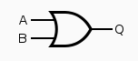

# Markdown 
*Italic*  
**Bold**  

> alternativ:  

_Italic_  
__Bold__

---

# Titel 1
## Titel 2  
  
> alternativ:  

Titel 1
=======
Titel 2
-------

---

[Link](https://www.youtube.com/watch?v=dQw4w9WgXcQ)  
  

> alternativ:  

[Link][1]  

[1]: https://www.youtube.com/watch?v=dQw4w9WgXcQ

![Bild][2]

[2]: images/and.png
---
> Blockquote
---

* Liste
* Liste
* Liste  

1. Erstens
2. Zweitens
3. Drittens  

> alternativ:

- Liste
- Liste
- Liste

1) Erstens
2) Zweitens
3) Drittens

---

Horizontale Linie:  
---

>alternativ:

***
---
`code`

```
Code
```
