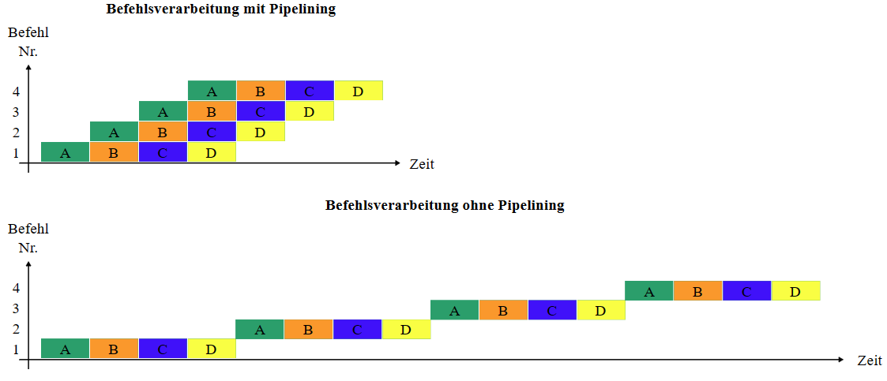

# Compiler

## Aufgabe eines Compilers

Ein Compiler ist eine **Software zur Übersetzung des Quellcodes einer Programmiersprache in einen für den Computer und dessen Betriebssystem ausführbaren Maschinencode**. Diese Übersetzung wird normalerweise in eine neue Datei gespeichert.

<https://de.wikipedia.org/wiki/Compiler>😁

## Wie kann ein Compiler Code-Optimieren?


### Function Inlining

Anstatt eine Funktion aufzurufen, wird oft für kurze Funktionen der Code der Funktion direkt an der Stelle, wo die Funktion aufgerufen würde, eingefügt. 

Vor dem Compilen:

```python
def add(a, b):
  return a + b

a = 2
b = 3
print(add(a, b)) # Hier geht das Programm zur Adresse im Code, wo die Funktion definiert ist
```

Nach dem Compilen :

```python
def add(a, b):
  return a + b

a = 2
b = 3
print(a + b) # Der Code ist direkt eingefügt worden
```


:::info
Es ist billiger ein paar Linien mehr im Programm, also im RAM zu speichern, als ein neues Frame auf den Stack zu platzieren, denn das braucht mehr Zeit

:::

### Constant Folding

Beim Compilen werden Befehle nicht nur in Maschinenlesbare Sprache übersetzt, sondern auch noch optimiert um sie effizienter zu machen. Diese Technik wird Constant Folding genannt. Konstanten werden z.B. schon vorher berechnet (während dem Kompilieren), was auch die Grösse des Codes reduziert. Wird x als 5 + 3 \* 2 definiert, um später ausgedruckt zu werden, wird der Wert für x schon vorher berechnet (hier 11) und x wird mit diesem Wert ersetzt.

```python
x = 5 + 3 * 2
print(x)

# Compiling \/ (x = 11)

print(11)
```

<https://www.geeksforgeeks.org/constant-folding/>


Folding ist eine Optimierungstechnik, die Ausdrücke eliminiert, die einen Wert berechnen, der bereits vor der Codeausführung bestimmt werden kann. Dabei handelt es sich in der Regel um Berechnungen, die nur auf konstante Werte verweisen, oder um Ausdrücke, die auf Variablen verweisen, deren Werte konstant sind

Betrachten Sie zum Beispiel die Aussage

Die meisten Compiler würden eigentlich keine zwei Multiplikationsanweisungen generieren. Stattdessen identifizieren sie Konstrukte wie diese und ersetzen die berechneten Werte (in diesem Fall 2048000). Auf diese Weise wird der Code ersetzt.

### Loop Unrolling

**Loop unrolling** ist eine Optimierungsmethode, die die [Laufzeit](https://de.wikipedia.org/wiki/Laufzeit_(Informatik) "Laufzeit (Informatik)") eines [Computerprogramms](https://de.wikipedia.org/wiki/Computerprogramm "Computerprogramm") auf Kosten der Größe seiner [Programmdatei](https://de.wikipedia.org/wiki/Ausf%C3%BChrbare_Datei "Ausführbare Datei") beschleunigen kann. Dabei wird eine [Schleife](https://de.wikipedia.org/wiki/Schleife_(Programmierung) "Schleife (Programmierung)")

* entweder durch eine äquivalente Schleife ersetzt, die mehrere Kopien des Schleifenrumpfes enthält und dafür eine geringere Anzahl an Durchläufen hat,
* oder komplett aufgelöst, indem der Schleifenrumpf so oft aneinandergereiht wird, wie die ursprüngliche Anzahl Durchläufe war.

Dadurch wird die Schleifenbedingung seltener oder gar nicht mehr überprüft.

Moderne Compiler versuchen Schleifen automatisch zu entrollen, falls auf Geschwindigkeit optimiert werden soll. Ist bekannt, auf welcher Architektur genau ein Programm später ausgeführt wird, kann eine manuelle Optimierung jedoch überlegen sein. 


Beispiel Python :)

```python
# Kein Loop unrolling
for i in range(5)
  print("Hello") # Hello 5 mal ausgeben
  
 # Unrolled Loop
 print("Hello")
 print("Hello")
 print("Hello")
 print("Hello")
 print("Hello")
```

Beispiel C:

```clike
for (int i=0; i<5; i++) // Abbruchsbedingung i<5 muss jedes mal überprüft werden, i++ muss jedes mal ausgeführt werden
  printf("Hello\n");
  
printf("Hello\n");
printf("Hello\n");
printf("Hello\n");
printf("Hello\n");
printf("Hello\n"); // Es ist effizienter, einfach 5 mal printf auszuführen
```

### Dead Code Elimination

Code welcher nie gebraucht wird eliminieren. → redundanter, unnötiger oder nicht-erreichbarer Code wird entfernt.

wird oft in der Entwicklung um Fehler zu finden im Code eingefügt, man vergisst aber nachher ihn zu löschen. Man nutzt das, um den Code zu optimieren.

Beispiel:

```clike
int foo(int x) {
    int y = 100 / x; // toter code da y nie verwendet wird
    int z = x * x;
    if (z >= 0) {  // unnötig da eine zahl mal sich selbst immer positiv ist
        return x * x;
    } else{
        return -1; // wird nie vorkommen da z immer grösser als 0 sein wird
    }
}
   
```

### Peephole Optimization

Eine kleine Gruppe von Compiler-generierten Anweisungen wird durch eine gleichwertige Gruppe mit besserer Leistung ersetzt. Dazu werden meistens folgende Techniken gebraucht:

* **Nullsequenzen** - Unnötige Vorgänge löschen.
* **Kombinieren von Operationen** - Ersetzt mehrere Operationen durch eine gleichwertige.
* **Algebraische Gesetze** - Verwendet algebraische Gesetze, um Anweisungen zu vereinfachen oder neu zu ordnen.
* **Sonderfallbefehle** - Verwendet Befehle, die für spezielle Operandenfälle konzipiert sind.
* **Adressmodusoperationen** - Verwendet Adressmodi zur Vereinfachung von Code

  \

Dient also zu (meistens kleinen) Leistungs-Verbesserungen von Compiler-generierten Anweisungen\n\nBeispiele:

```python
x = 2
y = x*2
print(y)

# Peephole
x = 2
y = x << 1 # binäre Zahl um eine Stelle nach links verschieben: 10b wird zu 100b
print(y)
```

* Sehr banal: `a=x-1-2+3` → optimiert zu `a=x`;
* oder `a=x*0` → `a=0`🧐

### ⭐ Instruction Pipelining

Beim Pipelining wird versucht, jeden Teil des Prozessors mit einer Anweisung zu beschäftigen, indem eingehende Anweisungen in eine Reihe aufeinanderfolgender Schritte (die namensgebende „Pipeline") aufgeteilt werden, die von verschiedenen Prozessoreinheiten ausgeführt werden, wobei unterschiedliche Teile der Anweisung parallel verarbeitet werden. 😊

 