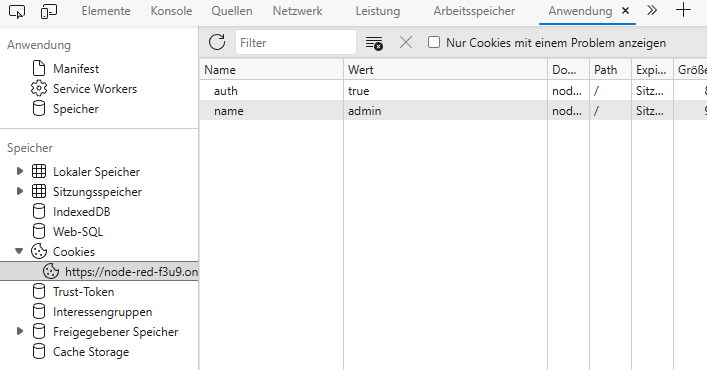

# Login-Seite
## I - Was ist ein Cookie
Ein Cookie ist ein kleines Stück Text, das von einem Webserver generiert und an einen Webbrowser bzw. ein Gerät gesendet wird. Der Browser bzw. das Gerät speichert die empfangenen Cookies für eine vorbestimmte Zeit oder für die Dauer einer Benutzersitzung auf einer Website. Bei zukünftigen Anfragen des Benutzers an den Webserver werden die relevanten Cookies angehängt.
## II - Weshalb ist ein Cookie praktisch? Wie funktioniert ein Login damit?
Ein Cookie kann Daten, wie Passwort und Benutzernamen speichern. Bei einem erneuten Aufrufen der Seite, erkennt die Seite das Cookie und kann die Daten (Passwort, Benutzername) direkt ablesen. Der Benutzer muss sich nicht jedes mal erneut einloggen, da der Server die Arbeit danks des Cookies übernimmt.  
## III - Unser Beispiel benutzt eine einfache Benutzerdatenbank. Was darf NIE so gemacht werden, wie wirs gemacht haben? Welche Ansätze gibts zur Verbesserung?
Es können unendlich viele Benutzer erstellt werden, in kürzester Zeit. Das kann die Datenbank schnell auslasten.  
Ein weiteres Sicherheitsproblem ist auch die Accountsicherheit. Erstens: Es gibt keine 2FA, Zweitens: Wenn man die Cookiedaten mit den Entwicklertools ändert, kann man sich auf jeden Account anmelden, solange man nur den Benutzernamen kennt.  
Man muss nur die Variable `name` gleich den Benutzernamen der Person setzen, in dessen Account man rein will, anschliessend muss man noch eine zweite Variable `auth` gleich `true` setzen. Anschliessend muss man die Seite neu ladeb und man ist im Account drin.
