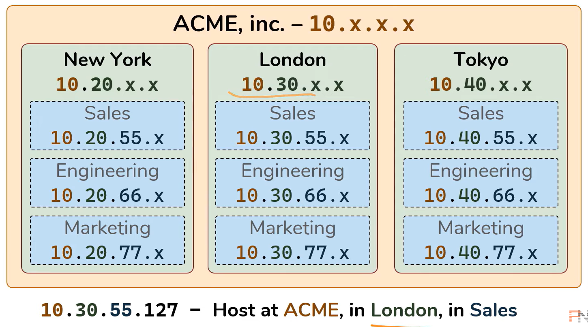
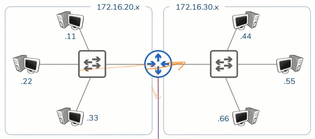
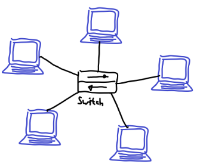
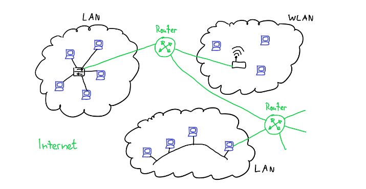
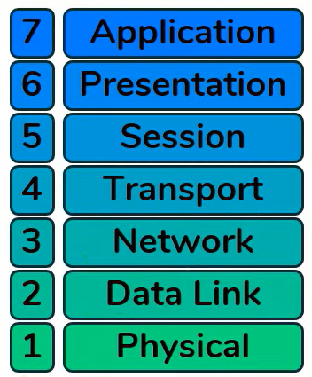
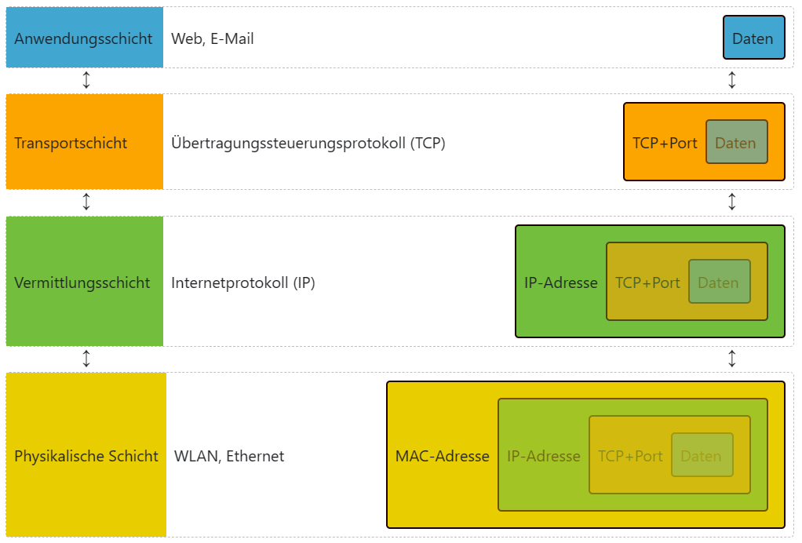
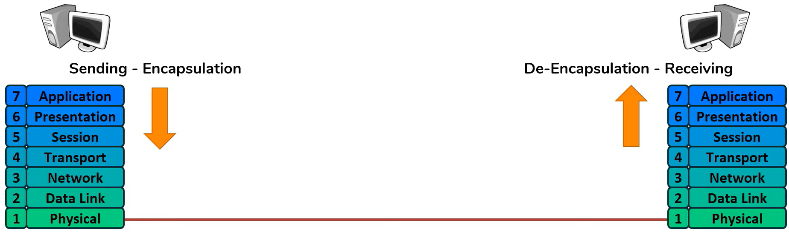
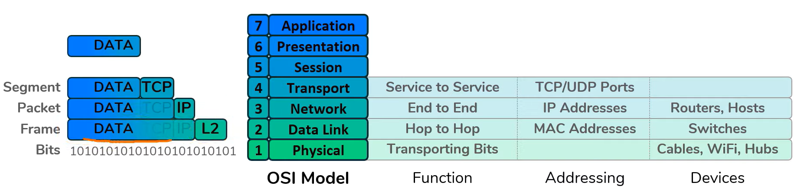

# Netzwerke

## Netzwerkgeräte

### Host
Der Host ist ein Gerät, das Daten über das Internet verschickt oder empfängt
### IP-Adresse
Die IP-Adresse ist eine Zahl mit der man ein Gerät in einem Netzwerk identifizieren kann. In unserem Beispiel hat die Firma ACME, inc. die IP-Adresse 10.x.x.x reserviert. Die weiteren Zahlen, wie die zweite, werden dann durch Faktoren wie Ort (New York: 20, London: 30, Tokyo: 40). Desweiteren kann die nächste Stelle der IP-Adresse einzelnen Gruppen in der Firma entsprechen. Die Zahl für die Gruppe kann unter allen Orten gleich sein, aber das macht nichts, da die Ortszahl unterschiedlich ist. Zuletzt kann man noch die letzte Zahl einem Gerät zuordnen, um dieses genau zu bestimmen.  
  
### Netzwerk
Als Netzwerk versteht man zwei oder mehrere Geräte, die verbunden sind. Fürher musste man für einen Datentransfer von einem Gerät zu einem anderen gehen, heute geht das über das Internet. 
### Repeater / Verstärker
Ein Signal, das über das Internet oder ein Kabel gesendet wird, nimmt an Stärke ab. Um sicherzustellen, dass es ankommt, muss das Signal verstärkt werden. Dafür gibt es sogenannte Verstärker, die diese Aufgabe übernehmen.
### Hub
Um Daten auszutauschen braucht es eins der folgenden Geräte. Zuerst gibt es den Hub. Wenn mehrere Geräte an ihm angeschlossen sind, und eines Daten an den Hub schickt, wird der Hub diese Daten an alle angeschlossenen Geräte schicken.
### Bridge
Um den Datenfluss zu kontrollieren, können Geräte an verschiedene Hub's angeschlossen werden und diese können dann mit Bridges verbunden werden. Wenn ein Gerät Daten an ein anderes Gerät innerhalb des eigenen Hub's senden will, erkennt das die Bridge und lässt die Daten im Hub-Netzwerk. Sprich: die Bridge leitet die Daten nicht an andere Hub-Netzwerke weiter.
### Switch
Eine Switch ist ein gerät, dass die Daten an ein Genaues Gerät schicken kann, je nach dem welche Anweisungen es erhält. Das heisst, dass niemand die Daten ungewollt erhält.
### Router
Ein Router kann nun die beiden Switch-Netzwerke verbinden um eine Kommunikation zwischen den beiden Switch-Netzwerken zu sichern. Er hat eine eigene IP-Adresse in einem Netzwerk. Diese kann in einem genauen Netzwerk sein wie 172.16.20.1 oder er kann auch Netzwerke verbinden indem er eine IP-Adressen-Stufe höher ist (172.16.20.x).  
  
## LAN und WAN
### LAN
LAN steht für Local Area Network. Es ist für einen bestimmten Ort bestimmt, der so gross wie ein Gebäude sein kann. Als Beispiel dient hier das Schulhausnetzwerk.
### WAN
WAN steht für Wide Area Network. Es ist für einen grösseren Bereich bestimmt, der ganze Kontinente umfassen kann. Als Beispiel dient hier das Telefonnetzwerk.

## Topologien
Als Topologie versteht man, wie die einzelnen Geräte an das Netzwek angeschlossen sind. Sie können alle an ein Kabel angeschlossen sein, aber auch je zu jedem Gerät eine private Verbindung haben. Beides hat seine Vor- und Nachteile.
### Bus
Alle Computer teilen sich ein kabel. Das wird Bus-Topologie genannt. Man spricht hier von einem shared Medium. Dabei kann nur ein Computer aufs Mal Nachrichten senden, da es sonst zu überlagerungen, löschungen usw. kommen kann und dann könnten Geräte Nachrichten empfangen, die nicht für sie bestimmt sind.
### Stern - Switch
Bei diesem Konzept sind alle Geräte mit einem zentralen Gerät verbunden. Dieses schickt Daten weiter, je nach dem, welche Adresse dabeisteht. Das bietet den Vorteil, dass nur beteiligte Computer die die Daten erhalten sollen die Daten auch erhalten. Falls aber mehrere Geräte an die Switch angeschlossen sind, muss diese schnell sein, um Rückstaus zu verhindern.  
  
### Das Internet / Das Router-Netzwerk
Ein Heimnetzwerk kann man sich wie eine Insel in den Weiten des Internets vorstellen. Wie die Topologie auf den jeweiligen Inseln ist, ist im Moment egal. Um Daten von einer Insel zur Nächsten zu schicken, braucht es sozusagen Seewege. Damit man sich aber nicht verfährt, gibt es Leuchttürme, sogenannte Router. Wenn Daten von einer Insel zu einem Router kommen, gibt er die Daten in die richtige Richtung weiter. Das kann schon zum Ziel sein, oder zu einem anderen Router.  
  
## IP-Adressen
### Aufbau
IPv4-Adressen haben den folgenden Aufbau:  
    - Sie bestehen aus vier Zahlen  
    - Jede davon ist jeweils ein Byte gross  
    - Die vier Zahlen werden in dezimaler Schreibweise geschrieben  
    - Die vier Zahlen sind jeweils durch Punkte getrennt  
    - Jede der vier Zahlen in einer IP-Adresse hat einen Wert zwischen `0` und `255`  
Beispiel:  
`10.166.226.146`  
Daraus lässt sich schliessen, dass eine IP-Adresse 32 Bit umfässt. 
### Netzwerk- und Hostteil
    - Der vordere Teil ist der Netzwerkteil. Er ist die Grundadresse und ist bei allen Geräten im gleichen Netzwerk gleich.  
    - Der hintere Teil ist der Hostteil. Er unterscheidet sich von Gerät zu Gerät im gleichen Netzwerk und darf nicht für zwei Geräte im gleichen Netzwerk gleich sein. Mit ihm lässt sich ein genaues gerät im Netzwerk identifizieren.  
### Netzmaske / Subnetzmaske
Die Subnetzmaske besteht in der binären Form links aus einsen und rechts aus nullen. Hier ein kleines Beispiel:  
`255.255.255.0 -> 111'111.111'111.111'111.000'000`  
Die einsen in der Subnetzmaske markieren den Netzwerkteil und die nullen den Hostteil. Das Wechseln von 1 zu 0 kann auch mitten in einem Byte passieren, wie beim folgenden Beispiel: `255.255.254.0 -> 111'111.111'111.111'110.000'000`  
Die Netzwerkadresse ist für den Gebrauch in einem Netzwerk (wie bei der Verbindung über mehrere Router) bestimmt, nicht für ein einzelnes Gerät.  
### Suffix
Um eine IP-Adresse richtig zu interpretieren, kann man nur die einsen in der Subnetzmaske zählen und sie dann an die IP-Adresse anschliessen:  
```
IP-Adresse:             13.162.25.4  
Netzmaske:              255.255.254.0  
Netzmaske Binär:        111'111.111'111.111'110.000'000  
Anzahl 1:               23  
IP-Adresse mit Suffix:  13.162.25.4/23  
```  
## Spezielle IP-Adressen
### 127.0.0.1
Loopback-Adresse, wird benutzt um eine Nachricht an sich selbst zu schicken.  
### 0.0.0.0
Platzhalter, steht für "ich habe noch gar keine gültige IP-Adresse", "eine beliebige IP-Adresse", oder für "das aktuelle Netzwerk".
### 224.0.0.0 - 239.255.255.255
IP-Multicasting, Wird in einem Netzwerk verwendet um Pakete an mehrere Nutzer gleichzeitig zu schicken (Gaming, Streaming etc.)  

## NAT
Es reicht, wenn die IP-Adressen in einem privaten Netzwerk unterschiedlich sind. Sind sie in einem anderen privaten Netzwerk gleich, ist das egal, da die Netzwerke ja privat und somit isoliert voneinander sind.  
Wenn aber zwei private Netzwerke miteinander kommunizieren wollen, braucht es einen Router, der den privaten IP-Adressen einen eindeutige öffentliche IP-Adresse zuordnet.  
Diese Übersetzung wird Network Address Translation (NAT) genannt und sit in allen Routern für Heimnetzwerke eingebaut.  

## Schichtenmodell
Jede Schicht hat ihren eigenen Nutzen. Nur wenn alle Schichten funktionieren, kann ein Host Daten teilen.  

### Ebene 1 - Physisch
    - Ziel: Bits transportieren
    - Daten existieren (in Form von einsen und nullen)  
    - Ein Transportmedium existiert  
    - E1 Technologie: Kabel, WLAN, Verstärker, Hub  
### Ebene 2 - Datenverbindung  
    - Ziel: Verbindung von NIC_1 zu NIC_2 erstellen  
    - Interagiert mit E1 (mit dem Kabel)  
    - Adressierungsschema: MAC-Adressen  
        - 48 Bits, als 12 Hexadezimale Zahlen  
        - Jede NIC hat eine eigene MAC-Adresse  
        - Dient nur dazu, ein Paket von z.B. Switch zu Switch zu schicken
    - E2 Technologie: NIC - Network Interface Card, Wi-Fi Access Card, Switch  
### Ebene 3 - Netzwerk
    - Ziel: Ende-zu-Ende transport der Daten
    - Interagiert mit E2 (mit der Switch)
    - Adressierungsschema: IP-Adressen
        - Dient dazu, eine Paket von z.B. PC zu PC zu schicken
    - E3 Technologie: Router, Host
### Ebene 4 - Transport
    - Ziel: Datenströme unterscheiden, sodass jedes Programm die richtigen Daten erhält
    - Interagiert mit E3 (mit dem PC)
    - Adressierungsschema: Ports
        - `0-65535` - TCP -> Schwerpunkt auf Zuverlässigkeit
        - `0-65535` - UDP -> Schwerpunkt auf Effizienz
        - Es handelt sich bei TCP und UDP um andere Strategien zur Datenverarbeitung
    - Beim Schicken einer Nachricht wird eine Quelle und ein Empfänger angegeben. Die Quelle besteht aus der Quell-IP und einem zufällig ausgewählten Port (`1.1.1.1:9999`). Der Empfänger besteht aus der Empfänger-IP und einem dort zugewiesenen Port (3.3.3.3:80).
    - Antwortet der Empfänger auf die Nachricht ist die Quell-IP gleich die vorherige Empfänger-IP (3.3.3.3:80) und die neue Empfänger-IP gleich die vorherige Quell-IP (1.1.1.1:9999)
    - Beim Kommunizieren mit einem anderen Server, kann der Client zwar auf den selben Port senden, muss dies aber mit einem anderen Quell-Port tun.
    - Eine Kommunikationslog könnte so aussehen (Protokoll, IP:Port, IP:Port):  
    ```
    TCP 1.1.1.1:6666 <-> 3.3.3.3:80
    UDP 1.1.1.1:9999 <-> 3.3.3.3:80
    TCP 1.1.1.1:5555 <-> 2.2.2.2:80
    ```  
    - Für jeden neu geöffneten Tab (zum gleichen Server), wird je ein neuer Quell-Port zugewiesen
### Ebene 5 - Sitzung
    - Ebene 5, 6 & 7 werden manchmal auch als eine Ebene zusammengefasst (TCP/IP-Modell)
    - 
### Ebene 6 - Präsentation
    - 
### Ebene 7 - Anwendung
    - 
### Schichtenmodell - Senden und Empfangen
Eine Anwendung generiert Daten. Diese werden an E4 weitergeleitet. Dort wird ein Header mit Protokoll, Quell- und Ziel-Port hinzugefügt ([Protokoll, Quell-Port, Ziel-Port], [Daten]). Dieses Datenpaket wird Segment genannt. Dieses Datenpaket wird zu E3 weitergeleitet, wo die Quell- und Ziel-IP hinzugefügt wird ([Protokoll, Quell-IP, Ziel-IP], [Quell-Port, Ziel-Port], [Daten]). Aus der Sicht der E3 sind die in E4 angehängten Port-Daten unnachvollziehbar. Dieses Datenpaket wird Packet genannt. Das Datenpaket wird nun weitergeleitet an E2. Dort wird ein weiterer Header angefügt, der die MAC-Adresse der nächsten Switch enthält. Bei jeder Switch wird die MAC-Adresse entfernt und aktualisiert, damit sie der nächsten Switch entspricht ([Quell-MAC-Adresse, Ziel-MAC-Adresse], [Protokoll, Quell-IP, Ziel-IP], [Quell-Port, Ziel-Port], [Daten]). Dieses Datenpaket wird Frame genannt. Anschliessend wird es über die E1 in einsen und nullen umgewandelt und über ein Medium übertragen.  
  
Beim Empfänger passiert das genaue Gegenteil.  
Der Prozess beim Senden wird "Encapsulation" also Kapselung genannt. Der Prozess beim Erhalten wird "De-Encapsulation" also Entkapselung genannt.  
  
  
Das Schichtenmodell ist keine Regel, sondern eher ein Vorschlag.  

## Was der Host macht um mit dem Internet zu sprechen
### Szenario 1 - Host 1 ist direkt mit Host 2 verbunden
Beide Hosts haben eine NIC und somit eine MAC-Adresse. Sie haben beide auch eine IP-Adresse und eine Subnetzmaske. Host A will Daten zu Host B schicken. Host A kennt die IP-Adresse von Host B. Die IP war entweder schon vorher bekannt, oder sie wurde durch die DNS beim Aufrufen eines Links in eine IP umgewandelt.

### Szenario 2 - Host 1 ist inirekt über eine Switch mit Host 2 verbunden

