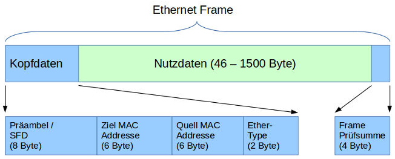

# Netzwerke

## Netzwerkgeräte

### Host
Der Host ist ein Gerät, das Daten über das Internet verschickt oder empfängt.
Folgende vier Dinge müssen jedes Mal bei einem Host konfiguriert werden, wenn er sich mit einem Netzwerk verbindet:  
- IP-Adresse		-	Identität im Internet
- Subnetzmaske		-	Grösse des Netzwerkes des Hosts
- Standart Gateway	-	Die IP-Adresse des Routers
- DNS Server IP(s)	-	Die IP-Adresse eines DNS Servers, der Domains in IP-Adressen umwandeln kann

### IP-Adresse
Die IP-Adresse ist eine Zahl mit der man ein Gerät in einem Netzwerk identifizieren kann. In unserem Beispiel hat die Firma ACME, inc. die IP-Adresse 10.x.x.x reserviert. Die weiteren Zahlen, wie die zweite, werden dann durch Faktoren wie Ort (New York: 20, London: 30, Tokyo: 40). Desweiteren kann die nächste Stelle der IP-Adresse einzelnen Gruppen in der Firma entsprechen. Die Zahl für die Gruppe kann unter allen Orten gleich sein, aber das macht nichts, da die Ortszahl unterschiedlich ist. Zuletzt kann man noch die letzte Zahl einem Gerät zuordnen, um dieses genau zu bestimmen.  
  
### Netzwerk
Als Netzwerk versteht man zwei oder mehrere Geräte, die verbunden sind. Fürher musste man für einen Datentransfer von einem Gerät zu einem anderen gehen, heute geht das über das Internet. 
### Repeater / Verstärker
Ein Signal, das über das Internet oder ein Kabel gesendet wird, nimmt an Stärke ab. Um sicherzustellen, dass es ankommt, muss das Signal verstärkt werden. Dafür gibt es sogenannte Verstärker, die diese Aufgabe übernehmen.
### Hub
Um Daten auszutauschen braucht es eins der folgenden Geräte. Zuerst gibt es den Hub. Wenn mehrere Geräte an ihm angeschlossen sind, und eines Daten an den Hub schickt, wird der Hub diese Daten an alle angeschlossenen Geräte schicken.
### Bridge
Um den Datenfluss zu kontrollieren, können Geräte an verschiedene Hub's angeschlossen werden und diese können dann mit Bridges verbunden werden. Wenn ein Gerät Daten an ein anderes Gerät innerhalb des eigenen Hub's senden will, erkennt das die Bridge und lässt die Daten im Hub-Netzwerk. Sprich: die Bridge leitet die Daten nicht an andere Hub-Netzwerke weiter.
### Switch
Eine Switch ist ein gerät, dass die Daten an ein Genaues Gerät schicken kann, je nach dem welche Anweisungen es erhält. Das heisst, dass niemand die Daten ungewollt erhält.  Weitere Infos tiefer bei `## Switches`.
### Router
Ein Router kann nun die beiden Switch-Netzwerke verbinden um eine Kommunikation zwischen den beiden Switch-Netzwerken zu sichern. Er hat eine eigene IP-Adresse in einem Netzwerk. Diese kann in einem genauen Netzwerk sein wie 172.16.20.1 oder er kann auch Netzwerke verbinden indem er eine IP-Adressen-Stufe höher ist (172.16.20.x).  
  
## LAN und WAN
### LAN
LAN steht für Local Area Network. Es ist für einen bestimmten Ort bestimmt, der so gross wie ein Gebäude sein kann. Als Beispiel dient hier das Schulhausnetzwerk.
### WAN
WAN steht für Wide Area Network. Es ist für einen grösseren Bereich bestimmt, der ganze Kontinente umfassen kann. Als Beispiel dient hier das Telefonnetzwerk.

## Topologien
Als Topologie versteht man, wie die einzelnen Geräte an das Netzwek angeschlossen sind. Sie können alle an ein Kabel angeschlossen sein, aber auch je zu jedem Gerät eine private Verbindung haben. Beides hat seine Vor- und Nachteile.
### Bus
Alle Computer teilen sich ein kabel. Das wird Bus-Topologie genannt. Man spricht hier von einem shared Medium. Dabei kann nur ein Computer aufs Mal Nachrichten senden, da es sonst zu überlagerungen, löschungen usw. kommen kann und dann könnten Geräte Nachrichten empfangen, die nicht für sie bestimmt sind.
### Stern - Switch
Bei diesem Konzept sind alle Geräte mit einem zentralen Gerät verbunden. Dieses schickt Daten weiter, je nach dem, welche Adresse dabeisteht. Das bietet den Vorteil, dass nur beteiligte Computer die die Daten erhalten sollen die Daten auch erhalten. Falls aber mehrere Geräte an die Switch angeschlossen sind, muss diese schnell sein, um Rückstaus zu verhindern.  
  
### Das Internet / Das Router-Netzwerk
Ein Heimnetzwerk kann man sich wie eine Insel in den Weiten des Internets vorstellen. Wie die Topologie auf den jeweiligen Inseln ist, ist im Moment egal. Um Daten von einer Insel zur Nächsten zu schicken, braucht es sozusagen Seewege. Damit man sich aber nicht verfährt, gibt es Leuchttürme, sogenannte Router. Wenn Daten von einer Insel zu einem Router kommen, gibt er die Daten in die richtige Richtung weiter. Das kann schon zum Ziel sein, oder zu einem anderen Router.  
  
## IP-Adressen
### Aufbau
IPv4-Adressen haben den folgenden Aufbau:  
- Sie bestehen aus vier Zahlen  
- Jede davon ist jeweils ein Byte gross  
- Die vier Zahlen werden in dezimaler Schreibweise geschrieben  
- Die vier Zahlen sind jeweils durch Punkte getrennt  
- Jede der vier Zahlen in einer IP-Adresse hat einen Wert zwischen `0` und `255`  
Beispiel:  
`10.166.226.146`  
Daraus lässt sich schliessen, dass eine IP-Adresse 32 Bit umfässt. 
### Netzwerk- und Hostteil
- Der vordere Teil ist der Netzwerkteil. Er ist die Grundadresse und ist bei allen Geräten im gleichen Netzwerk gleich.  
- Der hintere Teil ist der Hostteil. Er unterscheidet sich von Gerät zu Gerät im gleichen Netzwerk und darf nicht für zwei Geräte im gleichen Netzwerk gleich sein. Mit ihm lässt sich ein genaues gerät im Netzwerk identifizieren.  
### Netzmaske / Subnetzmaske
Die Subnetzmaske besteht in der binären Form links aus einsen und rechts aus nullen. Hier ein kleines Beispiel:  
`255.255.255.0 -> 111'111.111'111.111'111.000'000`  
Die einsen in der Subnetzmaske markieren den Netzwerkteil und die nullen den Hostteil. Das Wechseln von 1 zu 0 kann auch mitten in einem Byte passieren, wie beim folgenden Beispiel: `255.255.254.0 -> 111'111.111'111.111'110.000'000`  
Die Netzwerkadresse ist für den Gebrauch in einem Netzwerk (wie bei der Verbindung über mehrere Router) bestimmt, nicht für ein einzelnes Gerät.  
### Suffix
Um eine IP-Adresse richtig zu interpretieren, kann man nur die einsen in der Subnetzmaske zählen und sie dann an die IP-Adresse anschliessen:  
```
IP-Adresse:             13.162.25.4  
Netzmaske:              255.255.254.0  
Netzmaske Binär:        111'111.111'111.111'110.000'000  
Anzahl 1:               23  
IP-Adresse mit Suffix:  13.162.25.4/23  
```  
## Spezielle IP-Adressen
### 127.0.0.1
Loopback-Adresse, wird benutzt um eine Nachricht an sich selbst zu schicken.  
### 0.0.0.0
Platzhalter, steht für "ich habe noch gar keine gültige IP-Adresse", "eine beliebige IP-Adresse", oder für "das aktuelle Netzwerk".
### 224.0.0.0 - 239.255.255.255
IP-Multicasting, Wird in einem Netzwerk verwendet um Pakete an mehrere Nutzer gleichzeitig zu schicken (Gaming, Streaming etc.)  

## NAT
Es reicht, wenn die IP-Adressen in einem privaten Netzwerk unterschiedlich sind. Sind sie in einem anderen privaten Netzwerk gleich, ist das egal, da die Netzwerke ja privat und somit isoliert voneinander sind.  
Wenn aber zwei private Netzwerke miteinander kommunizieren wollen, braucht es einen Router, der den privaten IP-Adressen einen eindeutige öffentliche IP-Adresse zuordnet.  
Diese Übersetzung wird Network Address Translation (NAT) genannt und sit in allen Routern für Heimnetzwerke eingebaut.  

## Schichtenmodell
Jede Schicht hat ihren eigenen Nutzen. Nur wenn alle Schichten funktionieren, kann ein Host Daten teilen.  

### Ebene 1 - Physisch
- Ziel: Bits transportieren
- Daten existieren (in Form von einsen und nullen)  
- Ein Transportmedium existiert  
- E1 Technologie: Kabel, WLAN, Verstärker, Hub  
### Ebene 2 - Datenverbindung  
- Ziel: Verbindung von NIC_1 zu NIC_2 erstellen  
- Interagiert mit E1 (mit dem Kabel)  
- Adressierungsschema: MAC-Adressen  
    - 48 Bits, als 12 Hexadezimale Zahlen  
    - Jede NIC hat eine eigene MAC-Adresse  
    - Dient nur dazu, ein Paket von z.B. Switch zu Switch zu schicken
- E2 Technologie: NIC - Network Interface Card, Wi-Fi Access Card, Switch  
### Ebene 3 - Netzwerk
- Ziel: Ende-zu-Ende transport der Daten
- Interagiert mit E2 (mit dem Switch)
- Adressierungsschema: IP-Adressen
    - Dient dazu, eine Paket von z.B. PC zu PC zu schicken
- E3 Technologie: Router, Host
### Ebene 4 - Transport
- Ziel: Datenströme unterscheiden, sodass jedes Programm die richtigen Daten erhält
- Interagiert mit E3 (mit dem PC)
- Adressierungsschema: Ports
    - `0-65535` - TCP -> Schwerpunkt auf Zuverlässigkeit
    - `0-65535` - UDP -> Schwerpunkt auf Effizienz
    - Es handelt sich bei TCP und UDP um andere Strategien zur Datenverarbeitung
- Beim Schicken einer Nachricht wird eine Quelle und ein Empfänger angegeben. Die Quelle besteht aus der Quell-IP und einem zufällig ausgewählten Port (`1.1.1.1:9999`). Der Empfänger besteht aus der Empfänger-IP und einem dort zugewiesenen Port (3.3.3.3:80).
- Antwortet der Empfänger auf die Nachricht ist die Quell-IP gleich die vorherige Empfänger-IP (3.3.3.3:80) und die neue Empfänger-IP gleich die vorherige Quell-IP (1.1.1.1:9999)
- Beim Kommunizieren mit einem anderen Server, kann der Client zwar auf den selben Port senden, muss dies aber mit einem anderen Quell-Port tun.
- Eine Kommunikationslog könnte so aussehen (Protokoll, IP:Port, IP:Port):  
    ```
    TCP 1.1.1.1:6666 <-> 3.3.3.3:80
    UDP 1.1.1.1:9999 <-> 3.3.3.3:80
    TCP 1.1.1.1:5555 <-> 2.2.2.2:80
    ```  
- Für jeden neu geöffneten Tab (zum gleichen Server), wird je ein neuer Quell-Port zugewiesen
### Ebene 5 - Sitzung
- Ebene 5, 6 & 7 werden manchmal auch als eine Ebene zusammengefasst (TCP/IP-Modell)
- 
### Ebene 6 - Präsentation
- 
### Ebene 7 - Anwendung
- 
### Schichtenmodell - Senden und Empfangen
Eine Anwendung generiert Daten. Diese werden an E4 weitergeleitet. Dort wird ein Header mit Protokoll, Quell- und Ziel-Port hinzugefügt ([Protokoll, Quell-Port, Ziel-Port], [Daten]). Dieses Datenpaket wird Segment genannt. Dieses Datenpaket wird zu E3 weitergeleitet, wo die Quell- und Ziel-IP hinzugefügt wird ([Protokoll, Quell-IP, Ziel-IP], [Quell-Port, Ziel-Port], [Daten]). Aus der Sicht der E3 sind die in E4 angehängten Port-Daten unnachvollziehbar. Dieses Datenpaket wird Packet genannt. Das Datenpaket wird nun weitergeleitet an E2. Dort wird ein weiterer Header angefügt, der die MAC-Adresse der nächsten Switch enthält. Bei jeder Switch wird die MAC-Adresse entfernt und aktualisiert, damit sie der nächsten Switch entspricht ([Quell-MAC-Adresse, Ziel-MAC-Adresse], [Protokoll, Quell-IP, Ziel-IP], [Quell-Port, Ziel-Port], [Daten]). Dieses Datenpaket wird Frame genannt. Anschliessend wird es über die E1 in einsen und nullen umgewandelt und über ein Medium übertragen.  
  
Beim Empfänger passiert das genaue Gegenteil.  
Der Prozess beim Senden wird "Encapsulation" also Kapselung genannt. Der Prozess beim Erhalten wird "De-Encapsulation" also Entkapselung genannt.  
  
  
Das Schichtenmodell ist keine Regel, sondern eher ein Vorschlag.  

## Was der Host macht um mit dem Internet zu sprechen
### Szenario 1 - Host 1 ist direkt mit Host 2 verbunden
- Beide Hosts haben eine NIC und somit eine MAC-Adresse.  
- Sie haben beide auch eine IP-Adresse und eine Subnetzmaske.  
- Host A will Daten zu Host B schicken.  
- Host A kennt die IP-Adresse von Host B. Die IP war entweder schon vorher bekannt, oder sie wurde durch die DNS beim Aufrufen eines Links in eine IP umgewandelt.  
- Beide Hosts befinden sich, in Szenario 1, im gleichen Netzwerk. Das heisst, dass bei beiden IP-Adressen der Netzwerkteil (markiert durch die Einsen in der Subnetzmaske) gleich ist.  
Zuerst wird E3 des Schichtenmodells angewendet. Das heisst, dass an die Daten, die verschickt werden sollen eine Quell- und Empfänger-IP als E3 Header angehängt wird. Da das Datenpaket so aber noch nicht mit dem Kabel (E1) interagieren kann, wird es an E2 weitergegeben. Dort wird ein E2-Header angehängt, welcher jetzt die Quell- und Ziel-MAC-Adresse enthält. Die MAC-Adresse findet der Computer mithilfe des ARP (Adress-Resolution-Protocol) selbst heraus. In diesem Zustand kann das Datenpaket an den Empfänger gesendet werden. Dort werden Header der E2 und E3 schrittweise entfernt und dann können die Daten entfernt werden. Bei einem zukünftigen Datenaustausch der beiden Hosts, kann der ARP-Teil übersprungen werden, da die benötigte MAC-Adresse im ARP-Cache ist.  

### Szenario 2 - Host 1 ist inirekt über eine Switch mit Host 2 verbunden
- Beide Hosts haben eine NIC und somit eine MAC-Adresse.  
- Sie haben beide auch eine IP-Adresse und eine Subnetzmaske.  
- Host A will Daten zu Host B schicken.  
- Alle Geräte (Host A / B, Switch) haben einen ARP-Cache
- Host A kennt die IP-Adresse von Host B.
- Host A kennt die IP-Adresse des Routers (sie ist als das Standart-Gateway im Gerät konfiguriert)
- Host A weiss, dass die IP-Adresse von Host B in einem fremden / anderen Netzwerk ist. 
Der Ablauf ist der Gleiche wie in Szenario 1, nur dass Host A diesen nur für den nächsten Router durchgeht. Bei diesem wird aber nur der E2-Header entfernt und ein neuer angefügt um die Daten weiterzuschicken (wie in Szenario 1). Dieser Ablauf kann mehrere Male Passieren (wenn mehrere Router einbezogen sind) oder nur einmal, wenn nur ein Router zwischen Host A und B steht. Die MAC-Adresse des Routers ist im ARP-Cache von Host A gespeichert und kann nun für jede Datenverbindung zwischen Host A und einem Gerät in einem andern Netzwerk verwendet werden, wenn diese über den gleichen Router gehen soll. Das heisst: Ob Host A den Server X oder Y kontaktieren will, ist egal, da er die Daten nur an den Router senden Muss (dessen MAC-Adresse er bereits kennt) und dieser leitet weitere Schritte für das Senden an die angegebene IP-Adresse selbst ein. 

## Das Adress-Resolution-Protocol (ARP)
Das ARP ist im Prinzip ganz einfach:  
Wenn ich die MAC-Adresse eines Gerätes wissen will, sende ich an alle verfügbaren Geräte eine Nachricht mit dem ARP und der Brodcast-MAC-Adresse als E2-Header. Dieser Vorgang wird Brodcast genannt. In dieser Nachricht steht grundsätzlich folgendes: "Wenn es da draussen jemand mit der IP-Adresse X.X.X.X gibt, sende mir bitte deine MAC-Adresse. Meine lautet wie folgt: XXXX.XXXX.XXXX." Falls jemand die gesuchte IP-Adresse hat, wird dieses Gerät seine MAC-Adresse an die MAC-Adresse des anfänglichen Senders schicken (auch mithilfe des ARP). Wenn ein Gerät einer IP-Adresse eine MAC-Adresse zuordnen kann (z.B. durch ARP), wird diese Zuordnung im ARP-Cache gespeichert.  
- Zuerst wird festgestellt, ob das Ziel in einem Lokalen oder fremden Netzwerk ist:
    - Lokal: ARP für die IP des Ziels
    - Fremd: ARP für die IP des Routers
### MAC-Adresse
Eine IP-Adresse kann sich verändern, wenn sich ein Gerät in einem anderen Netzwerk befindet. Die MAC_Adresse ist jedoch für ein Gerät festgelegt und kann nicht verändert werden. Sie wird verwendet um Geräte innerhalb eines LANs zu addressieren.  
MAC-Adressen sind 6 Bytes lang und werden in der Regel als hexadezimale Zahlen geschrieben.  
Beispiele:  
```
A8-6D-AA-C6-66-00  ->  10101000-01101101-10101010-11000110-01100110-00000000
00-50-56-C0-00-08  ->  00000000-01010000-01010110-11000000-00000000-00001000
```  
Die Bindestriche können auch durch Doppelpunkte (:) dargestellt sein.  
### Brodcast-MAC-Adresse
Damit aber alle diese Nachricht erhalten, braucht das ARP einen bestimmten E2-Header (um mit der E1 interagieren zu können) der jedoch nicht einen bestimmte MAC-Adresse ist, sondern eine Brodcast-MAC-Adresse. Diese lautet:  
`FF-FF-FF-FF-FF-FF`  ->  `11111111-11111111-11111111-11111111-11111111-11111111`  

## Switches
Switches sind Geräte, dessen Hauptzweck Switching ist. Sie haben eine MAC-Adressen Tabelle, auf welcher die MAC-Adressen der angeschlossenen Geräte verschiedenen Ports zugeordnet sind. Diese haben eine IP- und MAC-Adresse, jedoch wird diese nur dann benötigt, wenn Daten VON oder ZU der Switch gesendet werden. Für alle Daten die DURCH die Switch gehen ist die IP- und MAC-Adresse nicht involviert. 
### Switching
Switching wird der Prozess genann, bei dem Daten innerhalb eines Netzwerkes bewegt werden. Eine Switch wird nur drei Aktionen ausführen:
#### Lernen - Learn
Wenn ein Datenpaket mit der Quell-MAC-Adresse bei Port X ankommt, wird die MAC-Adresse diesem Port X auf der MAC-Adressen-Tabelle der Switch zugeordnet. 
#### Fluten - Flood
Falls der Empfänger noch keine Zuordnung auf der MAC-Adressen-Tabelle der Switch hat, wird das Datenpaket dupliziert und an alle verfügbaren Ports gesendet. Dabei wird aber kein Datenpaket zurück an den Sender geschickt. Falls ein Gerät ein Datenpaket erhält, dass nicht für dieses Gerät bestimmt ist, wird das Gerät diese Daten verwerfen. 
#### Weiterleiten - Forward
Nutze die MAC-Adressen-Tabelle um Daten direkt durch den richtigen Port an die richtige MAC-Adresse zu senden. 
### Ein Beispiel zum besseren Verständnis
Wenn Host A (MAC-Adresse: a1a1) Host B (MAC-Adresse: d4d4) Daten zukommen lassen will, muss Host A als E2-Header die eigene Quell-MAC-Adresse als Sender (a1a1) und die Host B-MAC-Adresse als Empfänger (d4d4) angeben. Dieses Datenpaket (Frame) wird an die Switch gesendet. Diese wird durch `Learn` ihre MAC-Adressen-Tabelle Aktualisieren und falls der Ziel-MAC-Adresse kein Port zugeornet ist, `Flood` anwenden. Wenn Host B nun antwortet, kann die Switch wieder `Learn` anwenden und kennt nun den Port für die MAC-Adresse für Host B. Falls wie in unserem Beispiel die Switch aber eine Zuordnung für eine MAC-Adresse hat, wird `Forward` angewendet und das Datenpaket wird ohne weitere Umwege durch den richtigen Port gesendet. 
### Unicast Frame
Bei einer Übertragung handelt es sich um einen Unicast Frame, wenn die Empfänger-MAC-Adresse ein anderer Host ist. Wenn die Empfänger-MAC-Adresse auf der Tabelle einem Port zugeordnet ist, wird `Forward` und sonst `Flood` angewendet.
### Brodcast Frame
Bei einer Übertragung handelt es sich um einen Brodcast Frame, wenn die Empfänger-MAC-Adresse `FF-FF-FF-FF-FF-FF` ist. Hierbei ist es egal, ob die Empfänger-MAC-Adresse auf der Tabelle einem Port zugeordnet ist, dür die Daten wird immer `Flood` amgewendet.  
**Wichtig**: Ein Broadcast ist nur die Bezeichnung für einen Frame-Typen (wenn die MAC-Adresse `FF-FF-FF-FF-FF-FF` ist), während Flood eine Aktion ist, die die Switch ausführt. 
### Mehrere Switches
In unserem Beispiel will Host A Daten an Host B schicken. Wir gehen davon aus, dass Host A die MAC-Adresse von Host B kennt. Dabei werden die Daten zuerst an die blaue Switch geschickt. Dort wird `Learn` ausgeführt und anschliessend, da die blaue Switch die Empfänger-MAC-Adresse nicht kennt `Flood` (Unicast Flooding). Host C, der die Daten fälschlicherweise erhalten hat, wird diese verwerfen. Die grüne Switch, die nun durch `Learn` die MAC-Adresse von Host A dem Port zur blauen Switch zuordnet, wird gleich wie die blaue Switch verfahren. Host D, welcher die Daten fälschlicherweise erhalten hat, wird diese verwerfen. Host B. welcher die Daten erhalten sollte, behält diese. Für eine Rücksendung, wird Host B die Daten an die grüne Switch senden und da diese für die MAC-Adresse von Host A den Port zur blauen Switch gespeichert hat, wird sie die Daten an die blaue Switch senden und diese, die wiederum den Port für die MAC-Adresse von Host A gespeichert hat, wird die Daten durch den richtigen Port an Host A schicken. Dabei führen beide Switches den `Learn`-Prozess aus. Bei diesem Beispiel können einem Switch-Port mehrere MAC-Adressen zugeordnet sein.  
  
## Frame
Nachrichten in einem LAN werden in Form von Frames ausgetauscht. Ist dieses Kabelgebunden wird auch von Ethernet-Frames gesprochen. Ein Ethernet-Frame ist wie folgt aufgebaut:  
  
### Präambel / SFD
Enthält abwechslungsweise Einsen und Nullen um den Empfänger auf die Sendegeschwindigkeit einzustellen
### Ziel-MAC-Adresse
Die Adresse des Gerätes, an welches die Daten gerichtet sind
### Quell-MAC-Adresse
Die Adresse des Gerätes, welches die Daten sendet
### Ether-Type
Gibt an welches Protokoll (z.B. IP) für das Versenden in den Nutzdaten verwendet wird
### Nutzdaten
Eigentliche Nachricht
### Frame Prüfsumme
Ein vom Sender berechneter Wert aus dem Datenpaket. Der Empfänger wird mit dem gleichen Verfahren einen Wert aus dem Datenpaket berechnen. Der berechnete und der mitgesendete Wert werden verglichen. Dies dient der Überprüfung, ob die Daten richtig übertragen wurden. Stimmen sie überein, müsste das erhaltene Datenpaket, dem gesendeten entsprechen. Als Frame Prüfsumme kann z.B. ein Hash von den Nutzdaten gemacht werden.  

In einem WLAN ist der Prozess relativ gleich, jedoch kommen noch einige WLAN-spezifische Daten hinzu.  
## Routers
Wenn ein Gerät mit einem anderen, im gleichen Netzwerk kommunizieren will, können sie dies über eine Switch tun. Für die Kommunikation mit einem gerät in einem anderen Netzwerk wird ein Router benötigt. Diese haben auch eine MAC- und IP-Adresse für jedes Netzwerk mit dem sie verbundn sind. Diese IP- und MAC-Adresse kann in den verschiedenen Netzwerken für den gleichen Router unterschiedlich sein.  
Ein Router wird vom folgenden Satz in `RFC 2460` definiert: "Ein Knoten (Knoten = Gerät, das IPv6 (/4) eingebaut hat), der IPv6 (/4) Pakete weiterleitet, die nicht explizit an ihn gerichtet sind." Im gelichen RFC wird auch der Host als "jeder Knoten, der kein Router ist" definiert.  
Beispiel: Wenn ein Host ein Datenpaket erhält, das als Ziel-IP-Adresse nicht die des erhaltenden Hosts aufgeführt hat, wird der Host das Paket verwerfen. Ein Router andererseits, wird versuchen das Datenpaket trotzdem auszuliefern.  
### Routing 
Routing beschreibt den Prozess der Übertragung von Daten zwischen Netzwerken, welche grundsätzlich eine logische Anordnung von Hosts sind.  
Ein Router ist ein gerät, dessen Hauptzweck das Routing ist.  
### Routing Table
Um eine Übersicht zu haben, müssen alle Router eine Karte der mit ihm verbundenen Netzwerke anlegen. Diese wird `Routing Table` genannt. In dieser Tabelle sind Einträge, die `Routs`, also Routen, genannt werden. Dabei handelt es sich um Instruktionen, wie bestimmte Netzwerke erreicht werden können.  
Darin stehen dann Sachen wie:
```
Um das Netzwerk 10.0.55.x zu erreichen, sende Pakete über das Interface Links  
Um das Netzwerk 10.0.44.x zu erreichen, sende Pakete über das Interface Rechts
```  
In einem echten `Routing Table` wird das dann aber ein bisschen technischer aussehen.  
Wenn ein Router aber ein Paket erhält, dessen Ziel-IP-Adresse nicht im `Routing Table` vertreten ist, wird es das Paket verwerfen.  
Es gibt drei Methoden, `Routing Tables` zu verbreiten:  
#### Directly Connected - DC
- Eine DC-Route existiert für jedes Netzwerk, das direkt an den Router angeschlossen ist. 
- Im `Routing Table` wird dann folgendes stehen: `DC    10.0.55.x/24    Links`, o.ä.  
#### Static Route - S
- Eine S-Route muss manuell konfiguriert werden. 
- Diese Methode wird verwendet, wenn mit einem Netzwerk zwar kommuniziert werden soll, dieses aber nicht mit dem aktuellen Router verbunden ist. Dabei wird als Interface die IP-Adresse des Routers angegeben, der sowohl mit dem Netzwerk verbunden ist, mit dem der aktuelle Router verbunden ist, als auch mit dem Ziel-Netzwerk verbunden ist.  
- Das wird dann im `Routing Tabel` wie folgt aussehen: `Static    10.0.44.x/24    10.0.55.1`  
#### Dynamic Routes - D
- Eine D-Route wird im `Routing Table` gleich wie eine S-Route dargestellt
- Einem Router kann der Befehl zum dynamischen routen gegeben werden, worauf er bei seinen Nachbarroutern nachfragt, welche Routen diese gespeichert haben. Das heisst, dass die Routen untereinander ausgetausch werden.  
- Als kleines Beispiel wie das in einem `Routing Table` dargestellt wäre: `Dyn.    10.0.44.x/24    10.0.55.1`  
- Um das dynamische Routen zu regulieren gibt es Protokolle. Die gängigsten sind: `RIP`, `OSPF`, `BGP`, `EIGRP` und `IS-IS`  

Router haben auch eine ARP-Tabelle. Diese funktioniert genau so wie die vorher in `Switches` beschriebene ARP-Tabelle. Im gegensatz zu den Routing-Tabellen, starten ARP-Tabellen aber leer und erweitern sich dynamisch. Routing-Tabellen müssen aber vorher ausgefüllt sein. Das liegt daran, dass ARP-Tabellen erhaltene Daten, dessen Empfänger sie nicht kennen, an alle verbundenen schicken. Falls der Empfänger verbunden ist, geht also nichts verloren. Router andererseits, werden Daten, dessen Empfänger sie nicht kennen nicht einfach an alle schicken, sondern selbst verwerfen. Das heisst, dass auch wenn der Empfänger mit einem Router verbunden, aber er nicht in der Routing-Tabelle ist, die Daten nie bei ihm ankommen werden.  
  
### Router-Hierarchie
Es gibt einfache Gründe für eine Hierarchie. Darunter fallen:  
- Das Vergrössern ist einfacher (Einfacher zu scalen)  
- Geregeltere / stabilere Verbindungen  
- Wenn die Router in einer Linie zueinander verbunden werden und dann zum Internet, kann ein einziger Ausfall zu einem Ausfall aller darunterliegenden Netzwerke führen. Desweiteren brauchen Daten von einem Router ganz am Ende der Kette länger um ans Ziel zu kommen (höherer Ping) als von einem Router ganz am Anfang.
- Routen Summierung: Angenommen ein Router hat folgendes in der Routing-Tabelle:  
```  
10.20.55.0 /24  ->  R4
10.20.66.0 /24  ->  R4
10.20.77.0 /24  ->  R4
```  
Dann kann das alles in eine solche Routing-Tabelle vereinfacht werden:
```
10.20.0.0  /16  ->  R4
```  
Dabei kann sich sogar eine Tabelle die wie folgt aussieht:  
```
10.40.55.0 /24  ->  R5
10.40.55.0 /24  ->  R5
10.20.0.0  /16  ->  R5
```
In die folgende Tabelle verkürzen:  
```
10.0.0.0   /8   ->  R5
```  
Wenn wir jetzt aber ein Paket mit dem IP-Adressen-Ziel `10.40.77.x` an einem Router erhalten der die tabelle:  
```
10.40.77.0 /24  ->  DC
10.0.0.0   /8   ->  R5
```
hat, muss der Router entscheiden, wohin er die Daten schickt. In diesem Fall wird er die Daten an den spezifischsten ort der Routing-Tabelle schicken (/24 ist spezifischer als /8).  
Wenn die Daten aber an einen anderen Host ausserhalb des 10.0.0.0er Netzwerks gesendet werden sollen, also irgendwo anders im Internet, wird eine Standartroute mit der IP-Adresse 0.0.0.0 /0 verwendet (`0.0.0.0 -> R5` => "Für alles andere, nutze R5").  
  
## RFC
RFC steht für "Request for Comments". Dabei handelt es sich um Dokumente, die Internetstandarts definieren. RFC's sind grundsätzlich die Anleitungen, nach denen das Internet aufgebaut wurde. Wer also bei einer Diskusion über das Internet ein RFC vorweisen kann, hat sozusagen immer Recht.  
RFC's sind öffentlich. Ein Gerätehersteller muss sich nur an die RFC's halten und dann kann z.B. ein PC von Dell mit einem iPhone kommunizieren.  
## Protokolle
Protokolle sind eine Reihe von Regeln und Nachrichten, die die Internetstandarts definieren.  
Bei einer ARP-Anfrage z.B. musste vorher definiert werden, wie eine Nachricht aufgebaut sein sollte, wenn man eine Anfrage tätigt und wie die darauf folgende Antwort sein sollte. Im Fall von ARP, ist das im RFC 826 festgehalten.  
Im Internet gibt es tausende und alle dienen einem gewissen Zweck.   
### ARP
- Adress Resolution Protocol
- Kann mithilfe einer IP-Adresse des Ziels, dessen MAC-Adresse herausfinden.
### FTP
- File Transfer Protocol
- Erlaubt einem Client und einem Server, sich gegenseitig Dateien zu senden und diese auch zu erhalten. 
- Eine Konversation würde folgendermassen aussehen: Client: "RETR file.pdf", FTP Server: "file.pdf". In diesem Fall hätte der Client eine Datei angefordert und auch erhalten. 
### SMTP
- Simple Mail Transfer Protocol
- Dieses Protokoll wird von E-Mail-Servern genutzt um E-Mails auszutauschen. 
- Eine Konversation würde folgendermassen aussehen: Client: "HELO client.com", SMTP Server: "250 email.com". Ab diesem Zeitpunkt, können Client und Server E-Mails austauschen.
### HTTP
- Hyper Text Transfer Protocol
- Dieses Protokoll wird verwendet, wenn man mit Web Servern kommuniziert. Diese hosten Webseiten, die in HTML (Hyper Text Markup Language) geschrieben sind. Diese HTML-Seiten werden mit HTTP ausgetauscht. 
- Eine Konversation würde folgendermassen aussehen: Client: "GET /index.html", Web Server: "200 OK". Nach der "200 OK"-Nachricht, würde der Server die Webseite, nach der man gefragt hat, zur Verfügung stellen. 
### SSL & TLS
- Secure Sockets Layer & Transport Layer Security
- Dient dazu, einen gesicherten Tunnel zwischen Client und Server herzustellen, über welchen dann Daten, mit HTTP, ausgetauscht werden können.
### HTTPS
- HTTP Secured
- Es handelt sich um ein normales HTTP, das mit SSL / TLS gesichert ist. 
### DNS
- Domain Name System
- Da Server nichts anderes als Computer sind, die ab und zu Software für die verschiedenen Protokolle enthalten, geschieht die Kommunikation zwischen Client und Server gleich, wie ziwschen Client und Client. Dafür braucht es aber eine IP-Adresse. Ein FTP-Server z.B. hat standartmässig eine IP-Adresse, ein Webserver hat aber aus unserer Sicht nur eine Domain. Hierfür ist das DNS da. Es übersetzt Domains in IP-Adressen. Dafür wird es einen DNS-Server verwenden. 
- Eine Konversation würde folgendermassen aussehen: Client: "IP-Adresse für site.com?", DNS-Server: "site.com -> 160.8.23.154".
- DNS hat aber auch noch andere Funktionen.
### DHCP
- Dynamic Host Configuration Protocol
- DHCP konfiguriert einem Host die vier Elemente, die bei der Verbindung mit einem neuen Netzwerk nötig sind. Dazu gehört die IP-Adresse, eine Subnetzmaske, das Standartgateway und die IP-Adresse eines DNS-Servers. Das passiert jedes mal, wenn man sich mit einem WLAN verbindet. 
- Eine Konversation würde folgendermassen aussehen: Client: "Discover", Server: "Offer".
