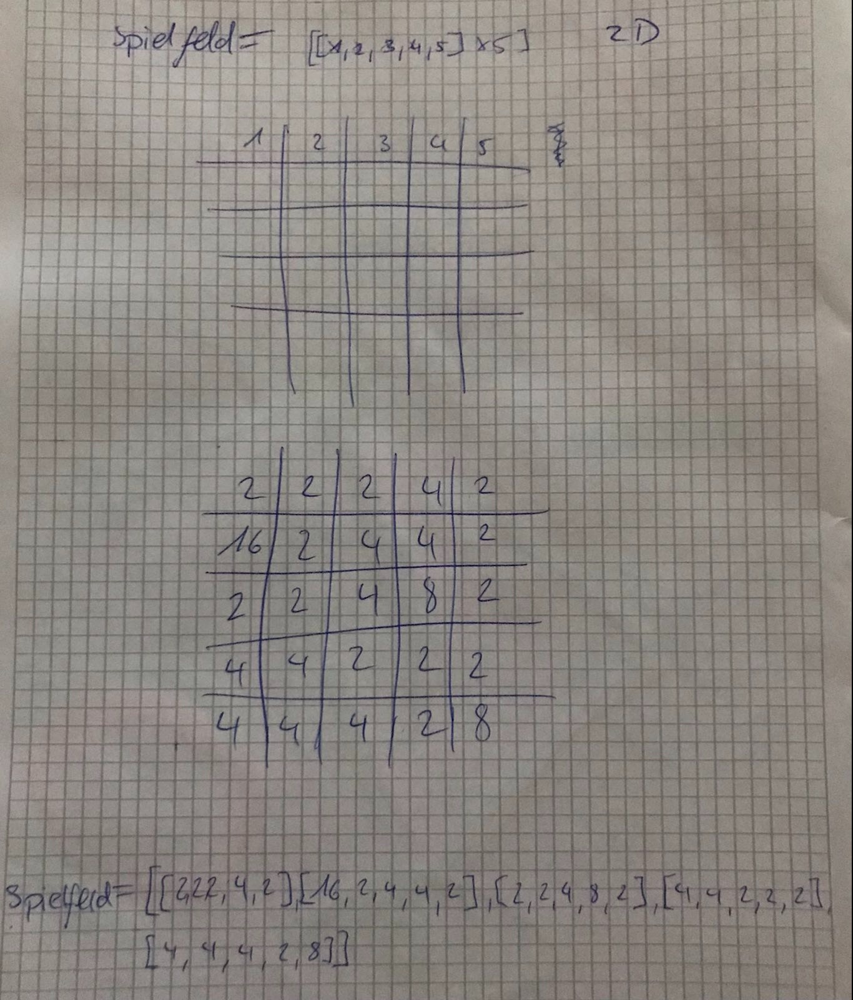

# Numtrip Datenstruktur

Um die Zahlen des Spiels zu speichern, können wir eine zweidimensionale Liste benutzen.  
Wir werden eine Liste machen (`list = []`) in der wir weitere fünf listen speichern (`list = [[],[],[],[],[]]`).  
Jede dieser Listen entspricht einer Zeile des Spiels. Das heisst, dass in jeder Unterliste fünf Zahlen gespeichert werden (`list = [[2, 4, 4, 8, 8],[2, 2, 4, 8, 2],[2, 2, 2, 16, 2],[4, 2, 2, 8, 2],[4, 4, 8, 8, 8]`).  

Hier ist noch ein Bild auf welchem die Datenstruktur skizziert ist.